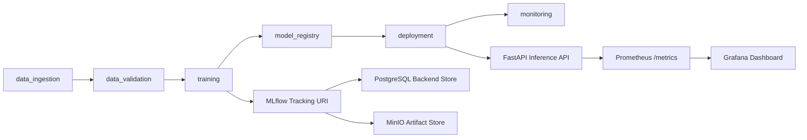

# Enterprise Vision MLOps Platform

This repository is a portfolio-grade MLOps platform for vision AI workloads. The first milestone is a local MLOps MVP that proves the end-to-end operating surface before adding Kafka, Spark, Kubernetes, Triton, KServe, and GPU scheduling.

## Current Milestone

Local infrastructure stack:

- MinIO for S3-compatible object storage
- PostgreSQL for MLflow backend metadata
- MLflow Tracking and Model Registry
- FastAPI inference service
- Prometheus metrics scraping
- Grafana dashboard provisioning
- Modular pipeline package under `src/evm`

## Quick Start

```bash
cp .env.example .env
docker compose up -d --build
docker compose ps
```

If `make` is available:

```bash
make stack-up
make stack-ps
```

## Local URLs

| Service | URL | Notes |
|---|---|---|
| API | http://localhost:8000 | FastAPI service |
| API docs | http://localhost:8000/docs | OpenAPI UI |
| MLflow | http://localhost:5000 | Tracking and registry |
| MinIO console | http://localhost:9001 | `minioadmin` / `minioadmin123` by default |
| Prometheus | http://localhost:9090 | Metrics backend |
| Grafana | http://localhost:3000 | `admin` / `admin` by default |

## Smoke Test

```bash
curl http://localhost:8000/health
curl http://localhost:8000/ready
curl -X POST http://localhost:8000/predict ^
  -H "Content-Type: application/json" ^
  -d "{\"image_uri\":\"s3://raw/sample.jpg\",\"features\":{\"width\":640,\"height\":480}}"
curl http://localhost:8000/metrics
```

PowerShell:

```powershell
Invoke-RestMethod http://localhost:8000/health
Invoke-RestMethod http://localhost:8000/ready
Invoke-RestMethod -Method Post http://localhost:8000/predict `
  -ContentType "application/json" `
  -Body '{"image_uri":"s3://raw/sample.jpg","features":{"width":640,"height":480}}'
```

## Modular Pipeline Commands

The codebase is organized as one large MLOps system with role-based pipeline modules. Each pipeline has matching documentation in `docs/pipelines`.

```bash
python scripts/run_pipeline.py data-ingest --config configs/local.toml
python scripts/run_pipeline.py data-validate --config configs/local.toml
python scripts/run_pipeline.py train --config configs/local.toml
python scripts/run_pipeline.py register-model --config configs/local.toml
python scripts/run_pipeline.py deploy-check --config configs/local.toml
python scripts/run_pipeline.py monitor-check --config configs/local.toml
```

If `make` is available:

```bash
make local-mvp
```

Pipeline reports are generated under `artifacts/reports`, while stable design docs live under `docs/pipelines`.

## Architecture



## Next Steps

1. Add data ingestion and validation pipeline.
2. Add reproducible baseline training with MLflow logging.
3. Register a baseline model in MLflow Model Registry.
4. Replace placeholder inference with registry-based model loading.
5. Add Kafka/Redpanda and Spark/Parquet data pipeline.
