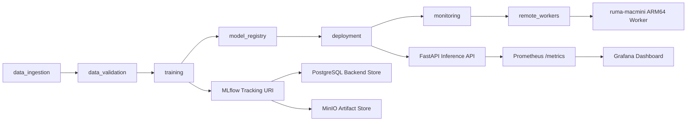

# Enterprise Vision MLOps Platform

This repository is a portfolio-grade AI infrastructure and MLOps platform for
manufacturing visual inspection workloads. The July 2026 cut is VLM-first: the
system should prove that a real industrial image dataset can be ingested,
versioned, validated, evaluated through a VLM adapter, observed, gated, rolled
back, and explained with audit/RCA evidence.

The goal is not a one-off VLM demo app. The goal is an enterprise-style
reliability lab for operating manufacturing visual inspection AI workloads.

## Current Milestone

Local infrastructure stack:

- MinIO for S3-compatible object storage
- PostgreSQL for MLflow backend metadata
- MLflow Tracking and Model Registry
- FastAPI inference service
- Prometheus metrics scraping
- Grafana dashboard provisioning
- Modular pipeline package under `src/evm`

W0-W3 established the control-plane foundation: Airflow orchestration, MLflow
traceability, MinIO-backed data platform, registry-driven serving, and mac-mini
remote job execution. W4/W5 now focus on the VLM-first manufacturing inspection
path: industrial dataset manifesting, data quality validation, VLM adapter and
router contracts, batch inference, regression gates, failure scenarios,
benchmarking, rollback, and portfolio-ready evidence.

## Large Data Storage Policy

Large local data and artifacts are intentionally stored outside this Git
repository.

| Runtime | Data / Artifact Root |
|---|---|
| Windows local | `F:\EnterpriseMLOps_Data\enterprise-vision-mlops` |
| Docker / Airflow | `/mnt/evm-data` |

The F-drive root is used for raw/processed/validated datasets, model artifacts,
VLM batch outputs, audit events, benchmark reports, and MinIO object data. The
repository keeps only code, configs, docs, and lightweight evidence.

## Home Lab Target Roles

| Node | Role |
|---|---|
| Windows 11 desktop / RTX 4080 SUPER / 64GB RAM | primary VLM inference, serving, benchmark, batch inference, failure simulation, GPU pressure |
| Mac mini M4 Pro / 24GB RAM | control-plane candidate, evaluator, metadata/audit, dataset manifest/indexing, monitoring, orchestration |
| MacBook Air M4 / 16GB RAM | development client, API/load-test client, demo operator, smoke-test client |

## Quick Start

```powershell
Copy-Item .env.example .env
.\scripts\dev\start_local_stack.ps1
```

`start_local_stack.ps1` is the canonical Windows entry point. It injects the
current Git revision into Compose, reconciles the Docker Desktop WSL GPU driver
path, and starts a supervised Kubernetes observer and lifecycle worker. Raw
`docker compose up` only starts containers and does not provide those host
runtime guarantees.

If `make` is available:

```bash
make stack-up
make stack-ps
```

## Local URLs

| Service | URL | Notes |
|---|---|---|
| API | http://localhost:8000 | FastAPI service |
| API docs | http://localhost:8000/docs | OpenAPI UI |
| MLflow | http://localhost:5000 | Tracking and registry |
| MinIO console | http://localhost:9001 | `minioadmin` / `minioadmin123` by default |
| Prometheus | http://localhost:9090 | Metrics backend |
| Grafana | http://localhost:3000 | `admin` / `admin` by default |

## Smoke Test

```bash
curl http://localhost:8000/health
curl http://localhost:8000/ready
curl -X POST http://localhost:8000/predict ^
  -H "Content-Type: application/json" ^
  -d "{\"image_uri\":\"s3://raw/sample.jpg\",\"features\":{\"width\":640,\"height\":480}}"
curl http://localhost:8000/metrics
```

PowerShell:

```powershell
Invoke-RestMethod http://localhost:8000/health
Invoke-RestMethod http://localhost:8000/ready
Invoke-RestMethod -Method Post http://localhost:8000/predict `
  -ContentType "application/json" `
  -Body '{"image_uri":"s3://raw/sample.jpg","features":{"width":640,"height":480}}'
```

## Modular Pipeline Commands

The codebase is organized as one large MLOps system with role-based pipeline modules. Each pipeline has matching documentation in `docs/pipelines`.

```bash
python scripts/run_pipeline.py domain-pack-check --config configs/local.toml
python scripts/run_pipeline.py data-ingest --config configs/local.toml
python scripts/run_pipeline.py data-validate --config configs/local.toml
python scripts/run_pipeline.py image-quality --config configs/local.toml
python scripts/run_pipeline.py dataset-shards --config configs/local.toml
python scripts/run_pipeline.py vlm-contract --config configs/local.toml
python scripts/run_pipeline.py vlm-batch-eval --config configs/local.toml
python scripts/run_pipeline.py vlm-reliability --config configs/local.toml
python scripts/run_pipeline.py vlm-rca --config configs/local.toml
python scripts/run_pipeline.py vlm-observability --config configs/local.toml
python scripts/run_pipeline.py train --config configs/local.toml
python scripts/run_pipeline.py register-model --config configs/local.toml
python scripts/run_pipeline.py deploy-check --config configs/local.toml
python scripts/run_pipeline.py monitor-check --config configs/local.toml
python scripts/run_pipeline.py remote-inventory --config configs/local.toml
```

If `make` is available:

```bash
make w4-vlm
make local-mvp
```

Pipeline reports are generated under the configured artifacts root, which is
`F:\EnterpriseMLOps_Data\enterprise-vision-mlops\artifacts` for local runs.
Stable design docs live under `docs/pipelines`.

## Architecture

Detailed connection maps and data contracts are maintained in
`docs/architecture-connectivity.md`.

The implementation agenda and final portfolio target are maintained in
`docs/agenda/enterprise-mlops-implementation-agenda.md`.
Roadmap and issue tracking are maintained in `docs/agenda/enterprise-mlops-roadmap.md`
and `docs/issues/issue-register.md`.



## Next Steps

1. Select the industrial anomaly dataset path, with VisA recommended as primary and MVTec AD as fallback or secondary.
2. Add manufacturing image manifest, validation, sharding, sampling, and retry/resume contracts.
3. Implement a VLM adapter interface with a mock adapter first, then connect a real Qwen2.5-VL 3B/7B quantized endpoint on the Windows RTX node.
4. Add manifest-based batch inference, structured output validation, prompt/model versioning, and regression gates.
5. Add failure scenarios, benchmark reports, RCA/audit linkage, rollback simulation, and final demo evidence.
