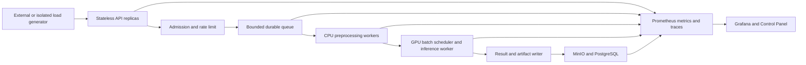

# Distributed Scale And Operational Load Validation Plan

Date: 2026-08-14
Status: Planned, implementation and load execution not started
Scope: single-node local MLOps runtime first, physical multi-node extension later
Canonical repository: `C:/Users/mlops/EnterpriseMLOps_Project/enterprise-vision-mlops`

## 1. Executive Decision

The project has already proved a governed local lifecycle across data intake,
Airflow, CUDA training, MLflow, isolated CT, approval, serving, Prometheus, and
failure guards. The next portfolio gap is not another model family. It is
measured systems behavior under concurrency, saturation, resource pressure,
partial failure, and release traffic.

The next workstream therefore uses lightweight ML workloads as controlled
resource probes. Model complexity is intentionally separated from systems
complexity. The target evidence is:

- where CPU, RAM, GPU, VRAM, queue, storage, or control-plane state saturates;
- whether the platform applies bounded admission and backpressure before OOM;
- how worker count, batch size, and queue delay change p95/p99 and throughput;
- whether retries, duplicate requests, worker loss, and rollout preserve state;
- which behavior is process/POD distribution on one host and which behavior is
  true physical multi-node distribution.

This plan does not claim multi-AZ availability, multi-GPU DDP, customer
production traffic, or business A/B testing.

## 2. Current Baseline And Honest Boundary

### 2.1 Available baseline

- Windows 11 host with Intel Core i9-12900K, 16 cores / 24 threads.
- Approximately 64 GiB host RAM.
- NVIDIA RTX 4080 SUPER with approximately 16 GiB VRAM.
- Docker Desktop resource envelope: 24 CPUs and approximately 31 GiB RAM.
- Docker Desktop Kubernetes: one physical node and one advertised GPU.
- Existing Compose services: Airflow, MLflow, MinIO, PostgreSQL, Prometheus,
  Grafana, API and Control Panel.
- Existing Kubernetes resources: Deployment, Job, PVC, GPU request, probes,
  security context, runtime observation, deployment and rollback evidence.
- Existing real workload families: EfficientNet-B0/B7 with VisA,
  SmolVLM-500M with ScienceQA, and Qwen2.5-0.5B with Dolly.

### 2.2 Current gaps that this workstream must not hide

- A single node cannot prove node-level failover or high availability.
- One GPU cannot prove horizontal multi-GPU scaling or distributed training.
- Multiple GPU Pods on one RTX 4080 share one physical fault domain.
- The current custom lifecycle queue and ledger are primarily polling/file
  based rather than a durable transactional queue-backed control plane.
- Existing serving paths do not yet provide a measured, bounded wait queue for
  every model family.
- Existing workload evidence is lifecycle-oriented; a repeatable capacity
  envelope, p99, saturation knee, soak, and queue-memory bound are not closed.
- Before any load run, the current serving Pod, Prometheus target, supervisor,
  and stale historical Jobs must be rechecked and separated from the baseline.

### 2.3 Interpretation rule

| Execution form | Allowed claim | Prohibited claim |
|---|---|---|
| Multiple processes on one host | concurrent process and resource-contention validation | physical cluster distribution |
| Multiple Pods on Docker Desktop Kubernetes | scheduler, cgroup, queue and Pod-recovery validation | node HA or multi-zone availability |
| One GPU shared by multiple clients | contention, fairness and admission validation | independent GPU isolation |
| Mac mini used as load generator or CPU worker | heterogeneous two-host execution | homogeneous Kubernetes GPU cluster |
| Controlled replay traffic | operational load and rollout validation | real customer traffic or business A/B |

## 3. Target Experimental Architecture



The queue is a capacity boundary, not a storage place for unlimited demand.
The GPU worker count is constrained by the single physical GPU. CPU workers
and stateless API replicas may scale independently.

## 4. Common Benchmark Contract

Every scenario must produce the same identity and measurement envelope.

### 4.1 Immutable identity

- `benchmark_run_id` and scenario version;
- Git source revision and dirty-worktree state;
- container image digest;
- data manifest and split digest;
- model name, model revision and artifact digest;
- configuration and threshold digest;
- namespace, workload name, Pod UID and worker identity;
- hardware, driver, CUDA, Torch and runtime versions.

### 4.2 Load profile

- warm-up: 2 minutes;
- steady state: 10 minutes minimum;
- cooldown: 2 minutes;
- independent repeats: 3 minimum;
- concurrency sweep: `1, 2, 4, 8, 16, 32, 64` where safe;
- arrival-rate sweep: `50%, 80%, 100%, 120%, 200%` of measured capacity;
- soak: 30 to 60 minutes for the final candidate configuration;
- load generator placement must be recorded as co-located or external.

### 4.3 Required metrics

| Layer | Required metrics |
|---|---|
| Request | RPS, accepted/rejected, p50/p95/p99/max, timeout, status code |
| Queue | depth, oldest age, enqueue/dequeue rate, wait p95/p99, DLQ, retry |
| Worker | active/idle count, task duration, restart, duplicate effect, lease age |
| CPU/RAM | CPU usage and throttling, RSS, working set, OOM, spill bytes |
| GPU/VRAM | utilization, memory allocated/reserved/peak, temperature, power, OOM |
| Batch | formed batch size, queue delay, compute time, instance utilization |
| Control plane | transaction conflict, connection-pool wait, idempotency result |
| Lifecycle | stage duration, recovery time, artifact count and hash closure |

### 4.4 Pass policy

- Thresholds are established from the low-load baseline, not invented first.
- The sustainable capacity point must satisfy the chosen latency and error
  budget for all three independent runs.
- Any hidden error, GPU OOM, unbounded queue growth, duplicate side effect,
  missing artifact, or identity mismatch fails the run.
- Optimized and baseline runs use the same data, request corpus, seed and
  observation window.
- Reports retain failed attempts and RCA instead of replacing them with only a
  final green result.

## 5. Resource-Oriented Workload Matrix

| Workload | Lightweight algorithm or model | Primary pressure | Why it is used |
|---|---|---|---|
| CPU preprocessing | image resize, normalization and feature extraction | CPU | separates Python/process and library thread contention from GPU work |
| Parallel experiment | logistic regression or small tree model per shard/config | CPU and scheduler | proves independent task distribution and result aggregation |
| Incremental clustering | MiniBatchKMeans over Parquet blocks | RAM and storage | proves bounded blocks, streaming and restartable aggregation |
| Online vision inference | EfficientNet-B0 or MobileNet-class model | GPU and queue | cheap enough for broad concurrency and batch-size sweeps |
| Memory pressure vision | EfficientNet-B7 or increased resolution | VRAM | provides a controlled upper-memory boundary after B0 baseline |
| VLM inference | SmolVLM-500M with governed ScienceQA records | GPU, VRAM and decode | validates image-text queue cost and request-size admission |
| LLM inference | Qwen2.5-0.5B with governed Dolly prompts | KV cache and token queue | validates TTFT, TPOT, token budget and long-request fairness |

The small models are test instruments. Portfolio evidence is based on
resource behavior and reproducibility, not benchmark superiority.

## 6. Scenario Backlog

### S0 / EVM-290: Runtime Baseline And Benchmark Evidence Contract

**Purpose**

Create a clean, reproducible benchmark baseline before changing queue,
scheduler, serving, or worker behavior.

**Work**

- recheck serving readiness, CUDA inference, Prometheus target and supervisors;
- separate active resources from historical Failed/Completed resources;
- correct readiness HTTP semantics so degraded readiness is not HTTP 200;
- add latency histograms, queue metrics, worker ownership, CPU/RAM/GPU/VRAM,
  batch, retry and identity labels with bounded cardinality;
- define a machine-readable benchmark manifest and result schema;
- run the low-load control case three times.

**Exit criteria**

- exact source/data/model/runtime identity is complete;
- p50/p95/p99, throughput and resource metrics are queryable for one run;
- repeated control runs are comparable and variance is reported;
- no stress execution begins on an unhealthy or ambiguous baseline.

### S1 / EVM-291: Online Capacity Envelope And Saturation Knee

**Load, data and model**

- real governed VisA requests;
- EfficientNet-B0 online inference;
- concurrency and arrival-rate sweeps from the common contract.

**Engineering**

- run both closed-model concurrency and open-model arrival-rate tests;
- separate request decode, preprocessing, queue wait and GPU compute time;
- keep dataset/model identity fixed across all runs;
- record the first point where p99, queue age, CPU or GPU changes slope.

**Exit criteria**

- sustainable RPS and saturation knee are calculated;
- p95/p99 and error rate are reported at each load step;
- the actual bottleneck is identified with telemetry rather than inferred from
  GPU allocation alone;
- the result becomes the sizing input for S3 queue capacity.

### S2 / EVM-292: Durable Control-Plane Concurrency And Idempotency

**Load, data and model**

- 100 to 500 concurrent lifecycle create, approve, cancel and retry requests;
- lightweight B0 metadata and synthetic request IDs; no GPU mutation required.

**Engineering**

- move durable job ownership and transition state behind PostgreSQL
  transactions;
- enforce unique idempotency keys and legal state transitions;
- use row locking or equivalent atomic claim semantics;
- bound connection-pool size and wait time;
- retain lease/fencing identity and reconcile stale owners.

**Exit criteria**

- duplicate lifecycle, approval, deployment intent and artifact effects are 0;
- conflicting approve/cancel operations end in one legal terminal state;
- pool saturation returns a bounded, observable result rather than hanging;
- worker loss and retry preserve a single committed outcome.

### S3 / EVM-293: Bounded Queue, Backpressure And Event-Driven Scaling

**Load, data and model**

- EfficientNet-B0 requests at 2x burst and 1.2x sustained measured capacity;
- poison, duplicate and expired requests are included as separate cases.

**Engineering**

- introduce a bounded external queue such as Redis Streams;
- use an in-process `asyncio.Queue(maxsize=N)` and bounded semaphore at the
  API/worker edge;
- derive capacity from conservative service rate `mu` and allowed queue wait
  `W`, with `K <= mu * W` as the starting bound;
- reject excess work with `429` and `Retry-After`;
- retry only transient failures with a budget, exponential backoff and jitter;
- move poison work to DLQ;
- use KEDA for CPU preprocessing workers, not unlimited GPU workers.

**Exit criteria**

- queue and process memory remain bounded under overload;
- accepted work completes or reaches one explicit terminal failure;
- duplicate side effects are 0 and poison work does not block healthy work;
- scale-up/down latency, oldest age and rejection behavior are measured.

### S4 / EVM-294: GPU Dynamic Batching And VRAM Optimization

**Load, data and model**

- EfficientNet-B0 first; B7 or increased resolution only after the safe B0
  envelope is known;
- batch sizes `1, 4, 8, 16` and queue delays `0, 2, 5, 10 ms`.

**Engineering**

- compare the current serving path with Triton dynamic batching;
- test model instance count separately from batch size;
- measure AMP, input resolution and bounded prefetch;
- record `memory_allocated`, `memory_reserved`, peak memory and allocator
  snapshots;
- compare exclusive GPU, time-sliced clients and MPS only if the local
  Docker Desktop/WSL runtime proves compatibility.

**Safety and claim boundary**

- RTX 4080 is not treated as MIG-capable;
- time-slicing is shared access, not VRAM or fault-domain isolation;
- MPS experiments require a separate compatibility gate and rollback path;
- a shared single GPU result is not called horizontal GPU scale-out.

**Exit criteria**

- throughput versus p99 and throughput versus peak VRAM Pareto curves exist;
- GPU OOM is 0 for the selected operating point;
- client fairness and interference are measured for shared-access modes;
- queue and batch settings are re-sized from the optimized service rate.

### S5 / EVM-295: Stateless API Availability And Release Under Load

**Load, data and model**

- traffic fixed near 70% of sustainable B0 capacity;
- known-good B0 and one deterministic bad candidate.

**Engineering**

- run two or three stateless API replicas with one bounded GPU backend;
- replace `Recreate` where safe with a measured RollingUpdate path for the API;
- configure readiness, graceful drain, PDB and HPA/custom queue metrics;
- terminate one API Pod while load continues;
- run shadow and controlled canary replay at 5% and 10%;
- block or roll back on quality, p99, error or identity guardrail violation.

**Exit criteria**

- API Pod replacement and connection drain are measured;
- accepted requests are neither lost nor duplicated during API rollout;
- a bad candidate creates no unapproved stable deployment;
- exact known-good model identity is restored after rollback;
- the report states that one GPU backend is not GPU serving HA.

### S6 / EVM-296: Distributed And Memory-Bounded Data Processing

**Load, data and model**

- VisA for semantic correctness;
- a deterministic, manifest-governed 25/50/100 GiB corpus for I/O and memory
  pressure only;
- Parquet partitions and image preprocessing outputs.

**Engineering**

- compare current single-process Python with parallel Kubernetes Jobs and a
  Ray Data or Spark execution candidate;
- stream/chunk records instead of materializing full JSONL or Arrow tables;
- set fixed block, prefetch and in-flight result bounds;
- test small-file compaction, skewed partitions, worker loss and restart;
- use MinIO as shared object storage and idempotent output commits;
- measure heap, shared/object-store memory, spill and storage throughput.

**Exit criteria**

- records/s, MiB/s, peak RSS, spill and scaling efficiency are reported;
- output has zero missing and duplicate records;
- retry produces the same manifest and output digest;
- copied or generated load records are never represented as new semantic
  training diversity.

### S7 / EVM-297: VLM And LLM Queue Fairness And Token Admission

**Load, data and model**

- SmolVLM-500M with governed ScienceQA image-text requests;
- Qwen2.5-0.5B with governed Dolly prompts;
- VLM and LLM execute sequentially on the one GPU;
- short/long request mix of approximately 80/20 with fixed seeds.

**Engineering**

- bound VLM image size and decode work before GPU admission;
- bound LLM input tokens, requested output tokens and in-flight token budget;
- compare FIFO with priority/fair scheduling;
- use quantization only when the exact runtime proves it;
- test long-request head-of-line blocking and tenant starvation;
- retain model-family-specific metric schemas.

**Exit criteria**

- VLM reports p95/p99, parse rate, task quality and decode/queue time;
- LLM reports TTFT, TPOT, tokens/s, completion rate and peak VRAM;
- GPU OOM and starvation are 0 at the selected admission limits;
- unsupported or unverified metrics remain absent rather than synthesized.

### S8 / EVM-298: Dependency Degradation, Soak And Evidence Closure

**Load, data and model**

- selected operating points from S1 through S7;
- 30 to 60 minute steady load at approximately 70% sustainable capacity.

**Engineering**

- inject bounded MinIO, MLflow, PostgreSQL and queue latency/failure with a
  controlled proxy or service-scoped fixture;
- verify timeout budgets, retry budgets, backoff+jitter and circuit breaking;
- restart only exact worker/API targets within declared safety boundaries;
- measure file descriptors, connection pools, memory slope and queue growth;
- run the final cross-layer soak only after individual scenarios pass.

**Exit criteria**

- retry amplification stays within the declared budget;
- the system recovers from dependency restoration without manual data repair;
- no memory, connection, queue or artifact growth remains unbounded;
- MTTR, request impact, data integrity and residual risk are recorded;
- one final evidence index re-hashes every accepted result.

## 7. Dependency And Execution Order

```text
S0 clean baseline and observability
  -> S1 current capacity envelope
  -> S2 durable state consistency
  -> S3 bounded queue and backpressure
  -> S4 GPU batching and VRAM optimization
  -> S1/S3 capacity re-calibration
  -> S5 API availability and controlled release
  -> S6 memory-bounded data distribution
  -> S7 VLM/LLM fairness and token admission
  -> S8 dependency degradation and final soak
```

S1 must precede S3 because queue capacity requires measured service rate. S2
precedes high-volume queued mutation because idempotency and durable ownership
must exist before retries are increased. S4 changes service rate, so S1 and S3
must be recalibrated after batching. S8 is last because combined fault tests
are meaningful only after each isolated bound is understood.

## 8. Implementation Layers

### Layer 1: Single-host, multi-process and multi-Pod proof

- external or explicitly co-located load generator;
- API replica scaling;
- bounded queue and CPU workers;
- one exclusive GPU worker first;
- Kubernetes requests/limits and cgroup behavior;
- full p95/p99, queue, CPU/RAM/GPU/VRAM evidence.

### Layer 2: Single-GPU sharing and inference optimization

- Triton dynamic batching;
- controlled time-slicing and MPS compatibility study;
- fair scheduling and VRAM admission;
- no MIG claim on RTX 4080.

### Layer 3: Physical multi-host extension

- Mac mini as an external load generator, ARM64 build validator, CPU/MPS edge
  inference worker, or data preprocessing worker after connectivity is live;
- a Linux node is preferred for a genuine Kubernetes worker;
- mixed x86/ARM image, dependency and artifact compatibility is part of the
  test, not assumed;
- only this layer may start making physical network and node-failure claims.

## 9. Evidence Layout

Large evidence remains on the F drive. The repository stores contracts and
indexes only.

```text
F:/EnterpriseMLOps_Data/enterprise-vision-mlops/artifacts/scale_validation/
  <scenario_id>/
    <benchmark_run_id>/
      manifest.json
      load-profile.json
      summary.json
      latency-histogram.json
      resource-samples.jsonl
      queue-samples.jsonl
      events.jsonl
      prometheus-snapshot/
      logs/
      artifacts/
      sha256sums.json
```

Each accepted run must include raw measurements, aggregate statistics,
configuration, exact identities, start/end timestamps, failed assertions,
cleanup result, hashes and claim boundary.

## 10. Portfolio And Interview Evidence

| Evidence | Hiring competency demonstrated | Likely interview challenge |
|---|---|---|
| Capacity envelope and knee point | performance engineering and capacity planning | Why is max RPS not the operating point? |
| Bounded queue and admission | backpressure and overload protection | How was queue capacity calculated? |
| Durable state and idempotency | distributed state and retry correctness | Why not claim exactly-once delivery? |
| GPU batching Pareto curve | inference systems and accelerator utilization | Why can batching improve throughput but hurt p99? |
| API Pod failure under load | Kubernetes operations and graceful degradation | What remains a single point of failure? |
| Controlled canary rollback | release engineering and guardrails | How is this different from business A/B? |
| Memory-bounded ETL | data systems and large-object handling | Where can OOM still occur after object spilling? |
| VLM/LLM fairness | generative serving admission and scheduling | How do token budgets prevent starvation/OOM? |
| Soak and dependency faults | reliability engineering and RCA | How did retries avoid amplifying an outage? |

### Claims allowed after successful execution

- measured single-node capacity and saturation behavior;
- implemented bounded admission, queue and worker concurrency;
- compared baseline and optimized GPU batch/VRAM configurations;
- proved idempotent control-plane transitions under concurrent requests;
- validated Pod-level scaling, failure containment and controlled rollback;
- measured distributed process/data execution on a single physical node;
- measured heterogeneous two-host execution only if that layer actually runs.

### Claims still prohibited

- multi-zone or multi-node production HA without physical-node proof;
- multi-GPU data/model parallelism without multiple GPUs;
- production SLA or customer traffic behavior;
- business A/B impact;
- TB-scale processing unless the measured corpus actually reaches that scale;
- isolated GPU tenancy from time-slicing alone.

## 11. Safety Gates

- Do not begin with GPU sharing. Establish an exclusive-GPU baseline first.
- Do not run a load generator on the same host without labeling the result as
  co-located and measuring load-generator resource use.
- Do not allow autoscaling to create more GPU consumers than the validated
  admission policy permits.
- Do not retry non-idempotent mutations without an idempotency key.
- Do not use an unbounded queue at any process or service boundary.
- Do not run combined faults until single-fault scenarios pass and cleanup is
  independently verified.
- Stop on ambiguous target identity, dirty baseline, OOM, data mutation, or
  monitoring loss.

## 12. Official Technical Basis

- Kubernetes requests, limits and cgroup behavior:
  https://kubernetes.io/docs/concepts/configuration/manage-resources-containers/
- Kubernetes parallel and work-queue Jobs:
  https://kubernetes.io/docs/concepts/workloads/controllers/job/
- Kubernetes Horizontal Pod Autoscaling:
  https://kubernetes.io/docs/concepts/workloads/autoscaling/horizontal-pod-autoscale/
- KEDA event-driven scaling:
  https://keda.sh/docs/latest/concepts/scaling-deployments/
- Python bounded asynchronous queues:
  https://docs.python.org/3/library/asyncio-queue.html
- Python semaphore primitives:
  https://docs.python.org/3/library/asyncio-sync.html
- NVIDIA Kubernetes GPU sharing semantics:
  https://github.com/NVIDIA/k8s-device-plugin
- NVIDIA MIG supported products:
  https://docs.nvidia.com/datacenter/tesla/mig-user-guide/supported-gpus.html
- NVIDIA MPS provisioning and memory limits:
  https://docs.nvidia.com/deploy/mps/when-to-use-mps.html
- NVIDIA Triton dynamic batching and queue policy:
  https://docs.nvidia.com/deeplearning/triton-inference-server/user-guide/docs/user_guide/batcher.html
- PyTorch CUDA memory management:
  https://docs.pytorch.org/docs/stable/cuda
- PyTorch automatic mixed precision:
  https://docs.pytorch.org/docs/stable/accelerator/amp.html
- PyTorch activation checkpointing:
  https://docs.pytorch.org/docs/stable/checkpoint
- Ray resource scheduling:
  https://docs.ray.io/en/latest/ray-core/scheduling/resources.html
- Ray Data execution and memory behavior:
  https://docs.ray.io/en/latest/data/data-internals.html
- Grafana k6 threshold evaluation:
  https://grafana.com/docs/k6/latest/using-k6/thresholds/

## 13. Cross-System Tracking

- Git branch: `codex/distributed-scale-validation-plan`
- Git plan revision: `019dff5`
- Jira Epic: `SCRUM-199 / EVM-EPIC-25`
- Jira tasks: `SCRUM-200..208 / EVM-290..298`; all To Do
- Notion: `https://app.notion.com/p/3bc10ad2dcad81ec9174d9686d5d1957`
- Obsidian:
  `F:/mlops_obsidian_db/mlops/08_Codex_Memory/01_Work_Logs/2026-08-14 Distributed Scale And Operational Load Validation Plan.md`
- Current status: planning only; no implementation, load test, runtime mutation,
  benchmark acceptance, or completion claim
