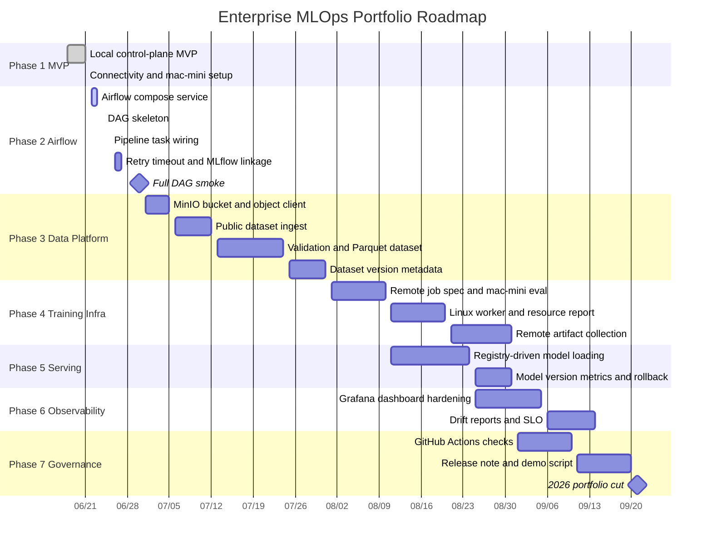
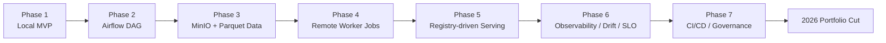

# Enterprise MLOps Roadmap

작성일: 2026-06-21

이 문서는 일정이 눈에 보이도록 관리하기 위한 roadmap이다. 상세 issue 목록은
`docs/issues/issue-register.md`를 source of truth로 둔다.

## Portfolio Roadmap

## Flow View

## Monthly Focus

| Month | Focus | Must-have Evidence |
|---|---|---|
| 2026-06 | Phase 1 hardening and Phase 2 start | Airflow service and first DAG run |
| 2026-07 | Data platform | MinIO object data, Parquet output, validation report |
| 2026-08 | Remote infra and serving | remote job result, registry-driven API |
| 2026-09 | Observability and portfolio cut | dashboard, CI, release note, demo script |
| 2026-Q4 | Cluster extension | Linux worker/k3s/GPU plan and implementation |
| 2027-Q1 | Enterprise hardening | KServe/Triton, drift, SLO, promotion gates |

## Weekly Review Rule

매주 다음을 갱신한다.

- `docs/issues/issue-register.md`
- `docs/status/YYYY-MM-DD-*.md`
- completed issue commit links
- blocked issue list
- next 7-day task list
