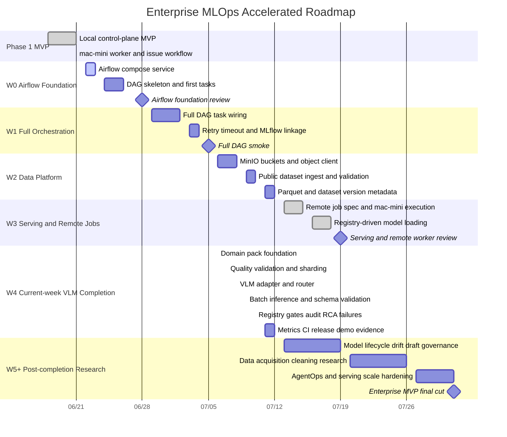
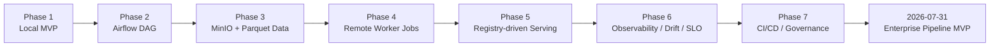

# Enterprise MLOps Roadmap

작성일: 2026-06-21

이 문서는 일정이 눈에 보이도록 관리하기 위한 roadmap이다. 상세 issue 목록은
`docs/issues/issue-register.md`를 source of truth로 둔다.

7월 말까지 enterprise MLOps pipeline MVP를 완성하는 압축 일정은
`docs/agenda/enterprise-mlops-accelerated-weekly-schedule.md`에서 관리한다.

완전한 enterprise vision/multimodal MLOps target architecture와 장기 확장
방향은 `docs/agenda/enterprise-multimodal-mlops-target-roadmap.md`에서
관리한다. 7월 MVP는 이 장기 target의 local control-plane foundation으로 본다.

## 2026-07-05 VLM-First Direction Reset

The July 31 cut is now VLM-first Manufacturing Visual Inspection AI Infra /
MLOps / AIOps. W0-W3 remain the completed control-plane foundation. W4 should
focus on real industrial image dataset manifesting, validation, sharding, VLM
adapter, router, and batch inference. W5 should focus on prompt/model
regression gates, failure scenarios, benchmark, RCA/audit, rollback simulation,
and portfolio evidence.

## 2026-07-06 Current-week Sprint Compression

The active plan is compressed again on 2026-07-06. The newly defined
enterprise VLM-first MLOps work is planned for completion during the current
week, 2026-07-06 to 2026-07-12. The former W5 reliability tasks are pulled into
the same completion sprint. W5 and later now track post-completion operating
research: real model lifecycle management, drift/special-case tracking,
draft/decision governance, large-scale data acquisition/cleaning, AgentOps
reliability, and serving-scale research.

## Accelerated Portfolio Roadmap

## Flow View

## Weekly Focus

| Week | Date | Focus | Must-have Evidence |
|---|---|---|---|
| W0 | 2026-06-22 ~ 2026-06-28 | Airflow foundation | Airflow UI and first DAG tasks |
| W1 | 2026-06-29 ~ 2026-07-05 | Full orchestration | full DAG run and MLflow linkage |
| W2 | 2026-07-06 ~ 2026-07-12 | Data platform | MinIO objects, Parquet output, dataset version |
| W3 | 2026-07-13 ~ 2026-07-19 | Serving and remote jobs | registry-driven API and mac-mini remote job evidence complete |
| W4 | 2026-07-06 ~ 2026-07-12 | Current-week enterprise VLM MLOps completion | industrial dataset quality/sharding, VLM adapter/router, batch inference, reliability gates, metrics, CI, final demo evidence |
| W5 | 2026-07-13 ~ 2026-07-19 | Real model lifecycle, serving, drift, and remote validation | trainable feature model, registry v9, lifecycle/lineage/special-case/RCA artifacts, API inference, visual evidence, Mac mini remote proof |
| W6 | 2026-07-20 ~ 2026-07-26 | Large-scale data acquisition and cleaning research | source policy, batch collection planner, dedup/quality benchmark, lakehouse ingestion research |
| W7 | 2026-07-27 ~ 2026-07-31 | AgentOps and portfolio hardening | AgentOps reliability design, scale serving research, final stabilization |

## Weekly Review Rule

매주 다음을 갱신한다.

- `docs/issues/issue-register.md`
- `docs/status/YYYY-MM-DD-*.md`
- completed issue commit links
- blocked issue list
- next 7-day task list
