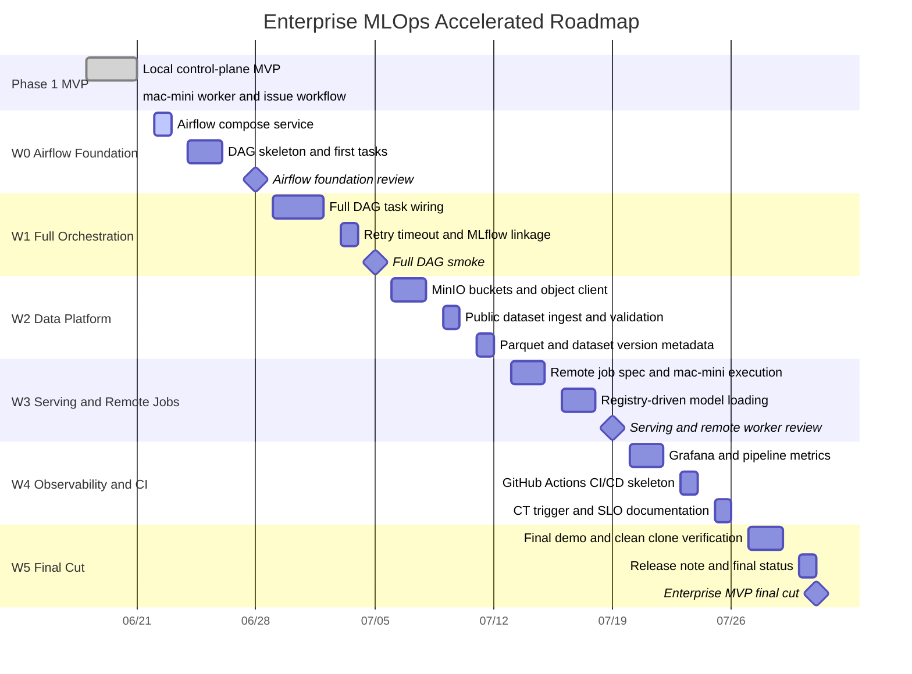
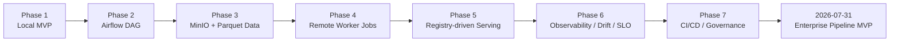

# Enterprise MLOps Roadmap

작성일: 2026-06-21

이 문서는 일정이 눈에 보이도록 관리하기 위한 roadmap이다. 상세 issue 목록은
`docs/issues/issue-register.md`를 source of truth로 둔다.

7월 말까지 enterprise MLOps pipeline MVP를 완성하는 압축 일정은
`docs/agenda/enterprise-mlops-accelerated-weekly-schedule.md`에서 관리한다.

## Accelerated Portfolio Roadmap

## Flow View

## Weekly Focus

| Week | Date | Focus | Must-have Evidence |
|---|---|---|---|
| W0 | 2026-06-22 ~ 2026-06-28 | Airflow foundation | Airflow UI and first DAG tasks |
| W1 | 2026-06-29 ~ 2026-07-05 | Full orchestration | full DAG run and MLflow linkage |
| W2 | 2026-07-06 ~ 2026-07-12 | Data platform | MinIO objects, Parquet output, dataset version |
| W3 | 2026-07-13 ~ 2026-07-19 | Serving and remote jobs | registry-driven API and mac-mini job result |
| W4 | 2026-07-20 ~ 2026-07-26 | Observability and CI/CD/CT | dashboard, CI workflow, CT skeleton |
| W5 | 2026-07-27 ~ 2026-07-31 | Final integration | final demo script and release note |

## Weekly Review Rule

매주 다음을 갱신한다.

- `docs/issues/issue-register.md`
- `docs/status/YYYY-MM-DD-*.md`
- completed issue commit links
- blocked issue list
- next 7-day task list
