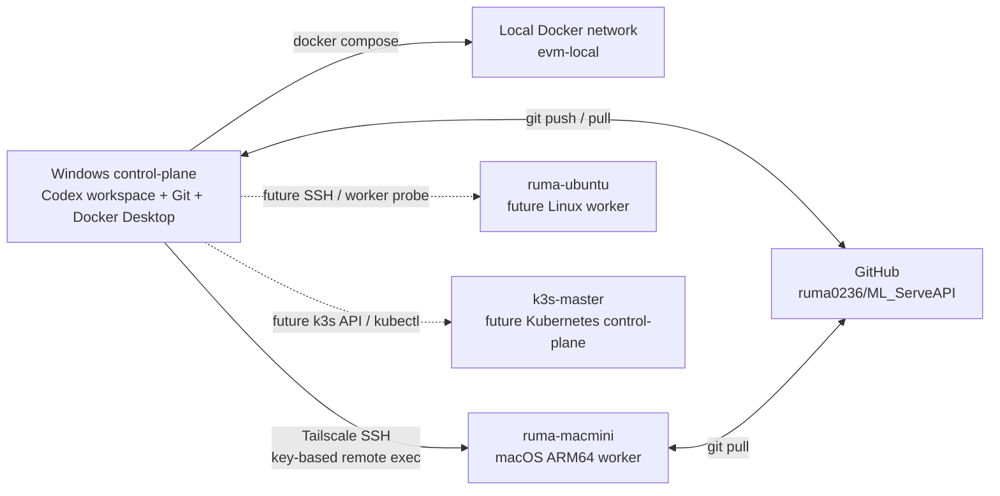
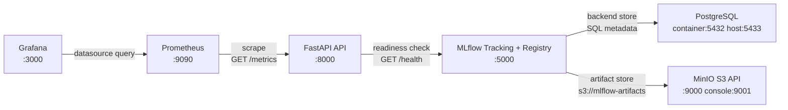
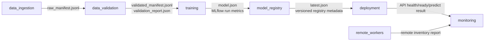

# Architecture Connectivity

This document defines how the current enterprise-vision MLOps system is wired
across machines, Docker services, and pipeline modules.

## Node-Level Topology

## Local Docker Service Topology

## Current Connectivity Status

| Link | Protocol | Current Status | Notes |
|---|---|---|---|
| Windows -> Docker Compose | Docker Engine API | healthy | `docker compose ps` shows API, MLflow, Postgres healthy and other services running. |
| API -> MLflow | HTTP inside `evm-local` | healthy | `/ready` returns `mlflow_ready=true` through `http://mlflow:5000`. |
| MLflow -> Postgres | PostgreSQL inside `evm-local` | healthy | Postgres healthcheck and `pg_isready` pass. |
| MLflow -> MinIO | S3-compatible HTTP inside `evm-local` | healthy | MinIO live/ready endpoint passes; MLflow server is healthy. |
| Prometheus -> API | HTTP inside `evm-local` | healthy | Prometheus target `api:8000/metrics` is `up`. |
| Grafana -> Prometheus | HTTP inside `evm-local` | healthy | Grafana `/api/health` returns database `ok`. |
| Windows -> mac-mini | Tailscale SSH | healthy | SSH remote exec returns `ruma`, `rumaui-Macmini.local`, `arm64`. |
| Windows -> Tailscale local status | Local Tailscale API | degraded | CLI exists, but local pipe access is denied in the current shell. Use SSH probe fields as the operational signal. |
| mac-mini -> GitHub | HTTPS Git | healthy | mac-mini clone tracks `codex/mac-mini-worker`. |
| Windows -> ruma-ubuntu | Tailscale SSH | unavailable | Candidate node exists but SSH port is not reachable in current probe. |
| Windows -> k3s-master | Tailscale/Kubernetes | unavailable | Candidate control-plane is not active in current probe. |

## Pipeline Module Topology

## Data Exchange Contract

| Producer | Consumer | Medium | Payload | Current Scope |
|---|---|---|---|---|
| `data_ingestion` | `data_validation` | Local manifest file | `data/raw/raw_manifest.jsonl` with `id`, `image_uri`, `label`, `width`, `height`, `source`, `ingested_at` | Synthetic seed manifest. |
| `data_validation` | `training` | Local manifest/report files | `data/validated/validated_manifest.jsonl`, `data/validated/validation_report.json` | Schema, extension, label, and dimension checks. |
| `training` | MLflow | HTTP REST | experiment, run, params, metrics | Logs baseline run when MLflow is healthy. |
| `training` | `model_registry` | Local artifact | `artifacts/models/vision-baseline/model.json` | Majority-class baseline model metadata. |
| `model_registry` | `deployment` | Local registry metadata | `artifacts/registry/vision-baseline/vN.json`, `latest.json` | Local file registry, not yet MLflow Model Registry source-of-truth. |
| `deployment` | API | HTTP | `GET /health`, `GET /ready`, `POST /predict` | Smoke validates serving contract. |
| API | Prometheus | HTTP metrics scrape | `/metrics` Prometheus exposition format | Request counters and latency histogram. |
| Prometheus | Grafana | HTTP datasource | target health and metric series | Dashboard-ready metrics source. |
| Windows control-plane | mac-mini | SSH command/result | branch sync, smoke commands, stdout/stderr, exit code | ARM64 worker validation and future edge/MPS experiments. |
| mac-mini | GitHub | Git HTTPS | branch checkout/pull for `codex/mac-mini-worker` | Keeps worker-specific code isolated. |

## Current Gaps

- Serving API still returns placeholder inference and does not load the local
  registry artifact yet.
- MLflow is used for run tracking, but the local file registry is still the
  deployment metadata source.
- Raw/validated object-store buckets are declared in config but the current
  manifest pipeline writes local files only.
- `remote_workers` can prove mac-mini SSH execution, but it does not yet submit
  structured remote jobs or collect remote artifacts back into the control-plane.
- Tailscale local status requires elevated access in this Windows shell, so
  `tailnet_online` may be unavailable even when SSH execution succeeds.
