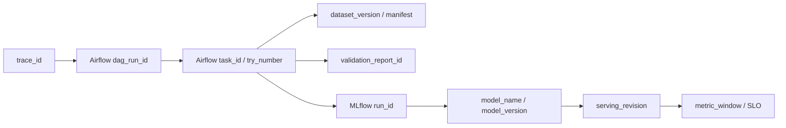

# Enterprise MLOps Traceability Architecture

## Purpose

Traceability is not a 1:1 ID mapping between Airflow and MLflow. The target
shape is a lineage graph that connects workflow runs, task runs, datasets,
validation reports, MLflow runs, model registry versions, serving revisions, and
monitoring windows.

## Lineage Shape



## W0 Foundation

W0 introduced the first trace context fields:

| Field | Source | Purpose |
|---|---|---|
| `trace_id` | `EVM_TRACE_ID` or Airflow DAG/run id | Correlates one DAG-level lineage graph |
| `pipeline_run_id` | local pipeline context | Identifies one pipeline command execution |
| `airflow_dag_id` | Airflow env/template | Workflow identity |
| `airflow_dag_run_id` | Airflow env/template | Workflow run identity |
| `airflow_task_id` | Airflow env/template | Task identity |
| `airflow_try_number` | Airflow env/template | Retry/attempt identity |
| `git_commit` | `EVM_GIT_COMMIT` | Code version |
| `git_branch` | `EVM_GIT_BRANCH` | Development branch |

For local Docker Compose runs, set `EVM_GIT_COMMIT` and `EVM_GIT_BRANCH` before
recreating Airflow services. The Airflow image does not include Git, so the
container cannot infer these values by itself.

Each pipeline run writes:

```text
artifacts/runs/<pipeline>/<run_id>/trace.json
```

Generated markdown reports also include the trace fields.

## W1 Target

W1 should complete the first useful lineage path:

```text
Airflow dag_run_id
 -> pipeline task run ids
 -> data manifest / validation report
 -> MLflow run_id
 -> model artifact path
 -> registry version
 -> deployment and monitoring reports
```

## Operating Rule

Every new pipeline stage must write enough metadata to answer:

- Which Airflow DAG run triggered this output?
- Which task and retry attempt produced it?
- Which data version or manifest was used?
- Which MLflow run produced the model?
- Which model version was promoted?
- Which serving revision consumed that model?
- Which metrics window validated runtime health?

This is the evidence line needed for enterprise-grade debugging, audit, and
portfolio explanation.
