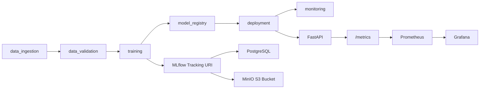

# Local MLOps MVP Architecture

## Purpose

The local stack provides a thin, runnable MLOps platform surface before adding distributed data processing, Kubernetes orchestration, GPU scheduling, and production-grade model serving.

## Components

| Component | Role | Local Service |
|---|---|---|
| Object storage | Model artifacts and data lake layout | MinIO |
| Metadata store | MLflow backend store | PostgreSQL |
| Experiment tracking | Params, metrics, artifacts, model registry | MLflow |
| Inference API | Stable serving contract and metrics endpoint | FastAPI |
| Metrics backend | Scrapes API metrics | Prometheus |
| Dashboard | Visualizes request rate and p95 latency | Grafana |
| Pipeline core | Shared config, run context, reports, HTTP/MLflow integration | `src/evm/core` |
| Role pipelines | Data, training, registry, deployment, monitoring modules | `src/evm/pipelines` |

## Runtime Flow

## Extension Points

- Data ingestion will write raw data to `s3://raw` or a dedicated MinIO bucket.
- Data validation will write reports to object storage and local artifacts.
- Training will log metrics and checkpoints to MLflow.
- Model serving will later load the registered model instead of using placeholder inference.
- Kafka, Spark, and Parquet will be added after this local MVP is stable.
