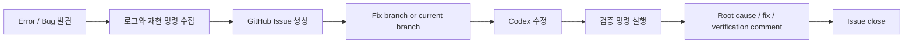

# Codex GitHub Issue Resolution Workflow

작성일: 2026-06-21

## Goal

Codex로 개발하는 중간에 bug, failed smoke test, infra mismatch, documentation gap이
발견되면 GitHub Issue로 기록하고, 수정/검증/종료 과정까지 commit history와 issue
timeline에 남긴다.

## Required Inputs

GitHub API를 사용하려면 Windows 환경에 token을 설정한다.

```powershell
$env:GITHUB_TOKEN = "<github-personal-access-token>"
```

필요 권한:

- `repo` 또는 fine-grained repository Issues read/write
- private repo라면 해당 repository access

`gh` CLI는 필수가 아니다. 이 repo는 Python 표준 라이브러리 기반
`scripts/dev/github_issue.py`를 사용한다.

현재 shell에 `GITHUB_TOKEN` 또는 `GH_TOKEN`이 없으면 `--dry-run`으로 issue
payload만 검증한다. 실제 GitHub Issue 생성은 token이 설정된 후 수행한다.

The script also creates missing default labels before creating an issue:

- `mlops`
- `bug`

Do not add a `codex-managed` label. Codex involvement is tracked through the
issue body, comments, commit messages, and status documents instead.

## Bug Discovery Flow



## Create Bug Issue

Dry run:

```powershell
python enterprise-vision-mlops/scripts/dev/github_issue.py `
  --cwd . `
  create-bug `
  --issue-id EVM-BUG-001 `
  --summary "remote-inventory reports tailnet unavailable despite SSH success" `
  --reproduction "python scripts/run_pipeline.py remote-inventory --config configs/local.toml" `
  --observed "tailnet_status_available=false while remote_exec_ready=true" `
  --expected "Inventory should distinguish Tailscale API access from SSH reachability" `
  --validation "python -m compileall src scripts`npython scripts/run_pipeline.py remote-inventory --config configs/local.toml" `
  --dry-run
```

Create real GitHub Issue:

```powershell
python enterprise-vision-mlops/scripts/dev/github_issue.py `
  --cwd . `
  create-bug `
  --issue-id EVM-BUG-001 `
  --summary "remote-inventory reports tailnet unavailable despite SSH success" `
  --reproduction "python scripts/run_pipeline.py remote-inventory --config configs/local.toml" `
  --observed "tailnet_status_available=false while remote_exec_ready=true" `
  --expected "Inventory should distinguish Tailscale API access from SSH reachability" `
  --validation "python -m compileall src scripts`npython scripts/run_pipeline.py remote-inventory --config configs/local.toml"
```

The command prints the created GitHub issue number and URL.

## Resolve Issue

After fixing and verifying:

```powershell
python enterprise-vision-mlops/scripts/dev/github_issue.py `
  --cwd . `
  resolve `
  --issue-number 123 `
  --root-cause "The current Windows shell cannot access the protected Tailscale local API pipe." `
  --fix "Separated tailnet status, TCP probe, SSH remote exec, and effective connectivity state." `
  --verification "python -m compileall src scripts`npython scripts/run_pipeline.py remote-inventory --config configs/local.toml" `
  --residual-risk "tailnet_online remains unavailable unless the shell has Tailscale pipe permission." `
  --close
```

The command posts the resolution comment. If `--close` is provided, it closes
the GitHub Issue after posting the comment.

## Codex Operating Rule

When Codex finds a bug during implementation:

1. Capture the failing command.
2. Capture observed and expected behavior.
3. Create or draft a GitHub Issue.
4. Use an issue-based branch name when practical.
5. Fix the issue.
6. Run validation commands.
7. Update docs/status or runbooks if the issue affects operation.
8. Comment with root cause, fix, verification, residual risk.
9. Close the issue only after verification passes.

## Commit Rule

Commit messages should include the issue ID:

```text
EVM-BUG-001 Fix remote inventory status fallback
```

GitHub will auto-link commits to issues if the issue number is included. Jira
will auto-link later if the Jira key is included in branch/commit messages.
