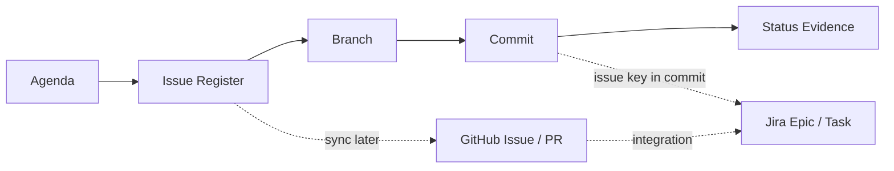

# Git, GitHub, and Jira Issue Workflow

작성일: 2026-06-21

## Goal

이 문서는 Git commit history, Markdown agenda, GitHub Issue, Jira를 같은 흐름으로
연결하기 위한 운영 규칙이다.

현재는 Jira connector가 없으므로 Git repository 문서를 source of truth로 사용한다.
Jira 연결은 `scripts/dev/jira_sync.py`와
`docs/runbooks/jira-schedule-sync.md`를 통해 REST API 방식으로 수행한다.

## Source of Truth

현재 우선순위:

1. `docs/agenda/enterprise-mlops-implementation-agenda.md`
2. `docs/issues/issue-register.md`
3. `docs/agenda/enterprise-mlops-roadmap.md`
4. Git commit history
5. GitHub Issues
6. Jira

Jira 연결 후 우선순위:

1. Jira Epic/Story/Task
2. GitHub commit/PR link
3. `docs/issues/issue-register.md` mapping table
4. `docs/status` 검증 기록

## Workflow



For Codex-managed bug discovery and resolution, use
`docs/governance/codex-github-issue-resolution-workflow.md`.

## Branch Rule

Use:

```text
codex/<issue-id>-short-slug
```

Examples:

```text
codex/evm-021-airflow-dag
codex/evm-035-minio-parquet
codex/evm-051-registry-serving
```

현재 장기 작업 브랜치:

```text
codex/mac-mini-worker
```

개별 이슈 규모가 커지면 이 브랜치에서 다시 feature branch를 분기한다.

## Commit Rule

Use:

```text
<ISSUE-ID> <imperative summary>
```

Examples:

```text
EVM-021 Add Airflow compose services
EVM-022 Add enterprise vision DAG skeleton
EVM-051 Load promoted model artifact in API
```

Jira를 연결하면 Jira key가 commit message에 포함되어 자동 링크된다.

## Issue Closure Rule

Issue를 `Done`으로 바꾸려면 다음 조건을 만족해야 한다.

- 구현 파일 또는 설정 파일 변경
- 검증 명령 실행
- 관련 문서 업데이트
- commit/push 완료
- 필요 시 mac-mini 또는 remote worker 동기화

## GitHub Issue Template Usage

GitHub Issues를 사용하기 시작하면 `.github/ISSUE_TEMPLATE/mlops-task.yml`를 사용한다.

필수 field:

- phase
- issue id
- objective
- acceptance criteria
- validation command
- documentation update target
- Jira mapping

## Jira Integration Plan

Jira project가 준비되면 다음 중 하나로 연결한다.

### Option A. GitHub for Jira App

권장 방식:

1. Atlassian Marketplace에서 GitHub for Jira 설치
2. GitHub organization/repository 연결
3. commit message와 branch name에 Jira key 포함
4. Jira issue에서 branch/commit/PR 상태 확인

장점:

- 표준적이고 유지보수 비용이 낮다.
- branch, commit, PR 링크가 자동으로 Jira에 붙는다.

### Option B. Jira REST API Sync Script

현재 적용 방식:

- `docs/issues/issue-register.md`에서 Epic/Task를 읽는다.
- `docs/agenda/enterprise-mlops-accelerated-weekly-schedule.md`에서 W0~W5 due date를 읽는다.
- `scripts/dev/jira_sync.py`가 Jira issue를 생성하거나 업데이트한다.
- source id는 Jira label로 남겨 중복 생성을 방지한다.
- `codex-managed` label은 사용하지 않는다.

Dry-run:

```powershell
python .\scripts\dev\jira_sync.py --project-root . --project-key EVM --dry-run
```

실제 sync:

```powershell
python .\scripts\dev\jira_sync.py --project-root . --mode all
```

### Option C. Jira Automation + Webhook

사용 조건:

- GitHub App 설치 권한이 없거나 custom rule이 필요한 경우

연결 방식:

- GitHub webhook 또는 Actions에서 Jira REST API 호출
- Jira Automation rule에서 branch, commit, PR event를 issue 상태와 연결

### Option D. Manual Mapping

초기에는 다음 table만 유지한다.

```text
Git issue id -> Jira key -> commit -> status doc
```

이 방식은 단순하지만 자동화 수준은 낮다.

## Schedule Visibility

일정은 다음 세 곳에서 볼 수 있게 한다.

- `docs/agenda/enterprise-mlops-roadmap.md`
- `docs/issues/issue-register.md`
- future Jira board

Jira 연결 후 board 구성:

| Board Column | Git Status |
|---|---|
| Backlog | `Planned` |
| Selected for Development | `Next` |
| In Progress | `In Progress` |
| Blocked | `Blocked` |
| Done | `Done` |

## Weekly Review Checklist

매주 확인할 것:

- 이번 주 완료 issue
- 다음 주 `Next` issue
- blocked issue
- phase별 일정 지연 여부
- docs/status evidence 누락 여부
- GitHub/Jira mapping 누락 여부
