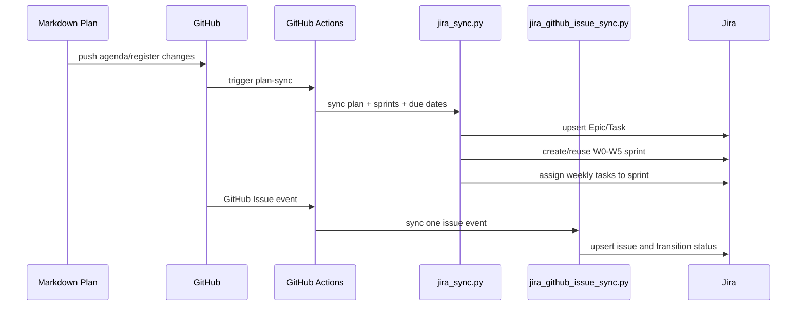

# Jira Realtime Sync Architecture

작성일: 2026-06-21

## Objective

Enterprise MLOps project의 계획, GitHub Issue, 작업 완료/진행 상태를 Jira Backlog,
Sprint, Timeline에 계속 반영한다.

## Source Systems

| Source | Role |
|---|---|
| `docs/agenda/enterprise-mlops-accelerated-weekly-schedule.md` | W0~W5 sprint/date 계획 |
| `docs/issues/issue-register.md` | Epic/Task/status source of truth |
| GitHub Issues | bug, incident, ad-hoc task event |
| Git commit history | 작업 완료 근거 |
| Jira | visible planning board and timeline |

## Sync Flow



## Jira Projection

| Jira Feature | Input |
|---|---|
| Backlog | Jira issues created from Markdown and GitHub Issues |
| Sprint | W0~W5 date ranges from accelerated weekly schedule |
| Timeline | Epic/Task hierarchy, due date, sprint |
| Issue status | Markdown status or GitHub Issue state/label |

## Status Mapping

| Project Status | Jira Transition Target |
|---|---|
| `Planned` | no forced transition |
| `Next` | `Selected for Development` or `To Do` |
| `In Progress` | `In Progress` |
| `Blocked` | `Blocked` |
| `Done` | `Done` |

If the Jira workflow uses different transition names, set
`JIRA_STATUS_TRANSITION_MAP`.

Example:

```json
{
  "Next": ["Selected for Development", "To Do"],
  "In Progress": ["In Progress"],
  "Blocked": ["Blocked"],
  "Done": ["Done"]
}
```

## Secrets

Required GitHub secrets:

- `JIRA_BASE_URL`
- `JIRA_EMAIL`
- `JIRA_API_TOKEN`
- `JIRA_PROJECT_KEY`
- `JIRA_BOARD_ID`

Do not store actual token values in Git.

## Limitations

- Jira Timeline behavior depends on project type and hierarchy configuration.
- Sprint creation and issue assignment require a Scrum board id.
- Status transition names are Jira workflow-specific.
- GitHub for Jira App is still recommended for native commit/branch/PR development panel links.
