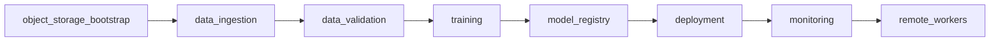

# Pipeline Overview

## Purpose

This project is organized as one modular MLOps platform. Each pipeline owns a clear lifecycle responsibility, while shared concerns live in `src/evm/core`.

## Pipeline Map

## Code Ownership

| Pipeline | Code | Document |
|---|---|---|
| Object storage bootstrap | `src/evm/pipelines/object_storage_bootstrap` | `docs/pipelines/08_object_storage.md` |
| Data ingestion | `src/evm/pipelines/data_ingestion` | `docs/pipelines/01_data_ingestion.md` |
| Data validation | `src/evm/pipelines/data_validation` | `docs/pipelines/02_data_validation.md` |
| Training | `src/evm/pipelines/training` | `docs/pipelines/03_training.md` |
| Model registry | `src/evm/pipelines/model_registry` | `docs/pipelines/04_model_registry.md` |
| Deployment | `src/evm/pipelines/deployment` | `docs/pipelines/05_deployment.md` |
| Monitoring | `src/evm/pipelines/monitoring` | `docs/pipelines/06_monitoring.md` |
| Remote workers | `src/evm/pipelines/remote_workers` | `docs/pipelines/07_remote_workers.md` |

## Shared Modules

- `src/evm/core/config.py`: TOML config loading and project path resolution.
- `src/evm/core/pipeline.py`: run context, JSON/JSONL helpers, markdown report writing.
- `src/evm/core/http.py`: dependency-free HTTP JSON client.
- `src/evm/core/mlflow_client.py`: minimal MLflow REST integration.
- `src/evm/core/object_store.py`: MinIO/S3 bucket, upload, list, and object-exists client.
- `src/evm/core/dataset.py`: dataset digest, distribution summaries, and Parquet writing.

## Orchestration

- Local CLI entrypoint: `scripts/run_pipeline.py`.
- Airflow DAG: `orchestration/airflow/dags/enterprise_vision_mlops_daily.py`.
- Current DAG path: `object_store_bootstrap -> data_ingest -> data_validate -> train -> register_model -> deploy_check -> monitor_check`.
- Airflow service config: `configs/airflow.toml`.

## Traceability

- Per-run trace metadata: `artifacts/runs/<pipeline>/<run_id>/trace.json`.
- Architecture note: `docs/architecture-traceability.md`.
- Current lineage target: propagate `trace_id` across Airflow, object storage,
  dataset metadata, MLflow, model registry, serving, and monitoring metadata.

## Update Log

- 2026-06-18: Added modular pipeline layout and shared core package.
- 2026-06-18: Verified full local MVP sequence from ingestion through monitoring.
- 2026-06-18: Added remote worker inventory layer for Tailscale-connected machines.
- 2026-06-21: Added Airflow W0 orchestration foundation for ingest and validation.
- 2026-06-22: Added traceability scaffolding for W1 lineage graph work.
- 2026-07-01: Added W2 object storage bootstrap, MinIO dataset objects, Parquet outputs, and dataset version metadata.
