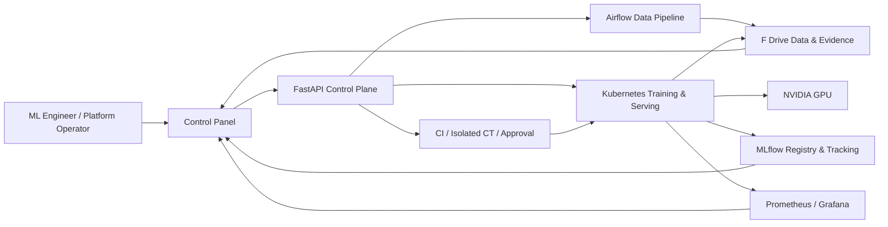

# Enterprise MLOps & AI Infra Control Plane

> 데이터 수집부터 GPU 학습, 검증, 승인을 거쳐 Kubernetes 배포와 모니터링까지 하나의 Control Panel에서 실행하는 로컬·하이브리드 MLOps 플랫폼

## 1. 한 줄 평가

이 프로젝트는 **실데이터 기반 제조 비전 모델의 staging 전체 lifecycle을 재현 가능한 증거와 함께 자동화한 강한 개인 포트폴리오**다. 다만 텍스트·LLM·VLM은 현재 데이터 intake와 품질 관리까지만 검증되었고, 멀티테넌시 보안·HA·대규모 부하 검증도 남아 있으므로 **대기업 production 플랫폼과 동등하다고 주장해서는 안 된다.**

## 2. 문제와 목표

대기업의 여러 부서가 각자 Airflow, MLflow, Kubernetes와 모델 artifact를 직접 추적하지 않고도 다음 작업을 수행할 수 있는 운영 화면을 목표로 했다.

1. 승인된 데이터 소스와 전처리 recipe 선택
2. immutable run profile에서 split, hyperparameter, gate, compute target 조정
3. dry-run 검증 후 실제 lifecycle 큐잉
4. 데이터 처리, 학습 epoch/step, 평가, CI/CT, 승인, 배포 상태 실시간 확인
5. 실패·blocker·drift 사유와 evidence URI 추적
6. 동일 profile, source revision, seed, artifact digest로 실행 재현

## 3. 구현 아키텍처

| 영역 | 구현 | 운영 목적 |
|---|---|---|
| Control Plane | React, FastAPI, Pydantic/OpenAPI | profile authoring, task assignment, 상태 집계, 정책 검증 |
| Data Orchestration | Airflow LocalExecutor | intake, validation, curation, shard, provenance workflow |
| Experiment Tracking | MLflow, PostgreSQL, MinIO | run, metric, parameter, model lineage 추적 |
| Training Runtime | Docker Desktop Kubernetes, NVIDIA GPU | resource request/limit가 있는 실제 Torch Job 실행 |
| Release | CI evidence, isolated CT, approval policy, deployment intent | `dry_run → pending_approval → queued → applied/failed/rolled_back` 제어 |
| Serving | Kubernetes Deployment/Service, CUDA inference | readiness/liveness와 실제 prediction 검증 |
| Observability | Prometheus, Grafana, Control Panel diagnostics | runtime, serving, drift, blocker 관측 |
| Evidence Storage | F 드라이브 authoritative root | TB급 데이터·artifact를 Git에서 분리하고 digest만 추적 |



## 4. 실증된 전체 Lifecycle

검증 대상은 VisA 공개 데이터와 Torch `efficientnet-b0`다. Control Panel에서 한 번 큐잉한 뒤 중간 파일 수정이나 수동 stage 전환 없이 완료되었다.

| 항목 | 실증 결과 |
|---|---|
| LifecycleRun | `lifecycle-20260713T164053-c701bd39` |
| Source revision | Git `23fb2a69fccef5aa1e91691daf9b1461e92f7cdc` |
| 실행 범위 | 10/10 stages completed |
| 원본 데이터 | VisA 10,821 records |
| 개발 view | train 6,504 + validation 2,136 = 8,640 |
| Isolated CT | test 2,181, training overlap 0 |
| 학습 | RTX 4080 Super, mixed precision, 408 optimizer steps |
| Early stop | 요청 20 epochs, 4 epoch에서 accuracy 0.93 조건 충족 |
| Validation | accuracy 0.9621, F1 0.8235, AUROC 0.9737 |
| CT | accuracy 0.9624, F1 0.8075, AUROC 0.9827 |
| MLflow | run `b35b5cc3d0704464abe2288e6e3548be`, status `FINISHED` |
| Model artifact | SHA-256 `cb29088e...3d35774`, 16.3 MB |
| Kubernetes | Job `evm-lifecycle-train-d4f3099138a1`, GPU allocatable 1, succeeded 1 |
| Serving | staging endpoint, CUDA model loaded, anomaly confidence 0.9827 |
| Monitoring | Prometheus target `up`, metrics endpoint 200 |

핵심은 metric 한 줄이 아니라 **dataset version → split digest → source commit → MLflow run → model digest → CT snapshot → deployment intent → serving probe**가 하나의 Run ID로 연결된다는 점이다.

## 5. 여러 부서 시나리오 검증

| 부서 시나리오 | 데이터 증거 | 현재 범위 | 정직한 blocker |
|---|---|---|---|
| 제조 품질 검사 | VisA 10,821 records | GPU 학습, CT, staging 배포, 모니터링 완료 | production HA·부하 검증 미완료 |
| 고객센터 intent routing | BANKING77 13,071 records, 77 labels | immutable intake, 교차 split 중복 7그룹 제거 | text training/serving adapter 미구현 |
| 사내 LLM instruction data | Dolly 15k 14,942 records | 길이 검증, 중복 제거, split, PII scan | PII 후보 141건 review required, LLM fine-tuning/serving 미구현 |
| AI 연구 VLM 평가 | ScienceQA image-text 512 records | 130 MB Parquet intake, 이미지 512개 추출·헤더 검증 | 비상업 라이선스, real VLM runtime/safety gate 미구현 |

이 구조는 임의 shell command를 전처리로 받지 않는다. registry에 등록된 parser와 transform만 실행하고, 지원되지 않는 modality/model은 fail-closed로 표시한다.

## 6. 운영자 UX

Control Panel은 목적별로 `Monitor`, `Build`, `Release`, `Govern` workspace를 분리한다.

- **Build / Blueprint**: 데이터, split, hyperparameter, CV/A-B 설정, gate, 자원 profile을 단계별 편집
- **Approved Use Cases**: 부서별 데이터·모델·배포 readiness와 라이선스, 레코드 수, blocker 확인
- **Task Studio**: dry-run, confirm, queue, runtime state, audit event 추적
- **Runs**: stage별 진행률과 epoch/step telemetry, retry capacity, evidence 확인
- **Release**: readiness, CI/CT, approval, deployment intent, rollback 상태 확인
- **Monitor**: serving, drift review, Kubernetes resource, Prometheus 상태 확인

이번 검수에서 발견한 두 가지 통합 결함도 수정했다.

1. UTC보다 미래인 Airflow DAG `start_date` 때문에 태스크 없이 0.01초 성공하던 문제
2. Airflow 완료 후에도 UI 배너가 `RUNNING / queued`에 머물던 runtime reconciliation 문제

## 7. 재현성과 품질 정책

- 소스 URL뿐 아니라 immutable revision, file size, SHA-256을 함께 검증
- 원본, normalized manifest, split manifest, quality report, source registry 분리
- holdout 우선 중복 제거로 BANKING77 교차 split 누수 제거
- PII 후보가 있는 Dolly는 실행 성공과 데이터 승인 상태를 분리해 `review_required` 처리
- ScienceQA는 `CC-BY-NC-SA-4.0`을 유지해 commercial production 용도로 승격하지 않음
- lifecycle evidence validator가 4개 scenario와 최신 10-stage run의 artifact 존재·digest·runtime state를 재검증

검증 명령:

```powershell
$env:PYTHONPATH = (Get-Location).Path
C:\Users\opop0\miniconda3\python.exe scripts\dev\validate_portfolio_evidence.py `
  --output F:\EnterpriseMLOps_Data\enterprise-vision-mlops\artifacts\portfolio\2026-07-14\enterprise-portfolio-evidence.json
```

## 8. 공개 프로젝트 대비 설계 기준

이 프로젝트는 공개 구현을 기능 목록으로 복사하지 않고, 다음 운영 원칙을 비교 기준으로 사용했다.

| 공개 기준 | 반영한 원칙 | 현재 차이 |
|---|---|---|
| [Kubeflow Pipelines](https://github.com/kubeflow/pipelines) | 재사용 가능한 pipeline과 runtime orchestration | 범용 component SDK와 managed multi-user control plane은 미완료 |
| [Kubeflow Manifests](https://github.com/kubeflow/manifests) | namespace, admission, multi-tenancy 필요성 | 로컬 단일 운영자이며 SSO/RBAC/NetworkPolicy 실증 부족 |
| [Spotify ML Home](https://engineering.atspotify.com/2022/1/product-lessons-from-ml-home-spotifys-one-stop-shop-for-machine-learning) | 중앙 metadata와 end-to-end user journey | discovery는 구현했지만 조직 규모 ownership/검색은 제한적 |
| [Google Vertex AI E2E samples](https://github.com/GoogleCloudPlatform/vertex-pipelines-end-to-end-samples) | template 재사용, sandbox-to-production, CI/CD | 로컬 staging 실증이며 cloud IAM/managed scale은 없음 |
| [Google MLOps with Vertex AI](https://github.com/GoogleCloudPlatform/mlops-with-vertex-ai) | CI test 후 pipeline compile/upload와 CT trigger | GitHub Actions·isolated CT는 구현, 다중 환경 GitOps는 추가 필요 |
| [DataTalksClub MLOps Zoomcamp](https://github.com/DataTalksClub/mlops-zoomcamp) | experiment, orchestration, deployment, monitoring, CI/CD/IaC 전체 흐름 | 튜토리얼 범위를 넘어 UI와 evidence contract를 추가했으나 IaC 범위는 약함 |
| [Microsoft MLOps](https://github.com/microsoft/MLOps) | enterprise reference architecture와 repeatable deployment | Azure identity, workspace isolation, policy-as-code는 미구현 |
| [Azure CV MLOps v2 demo](https://github.com/Azure/mlops-v2-cv-demo) | CV lifecycle과 environment promotion | local Kubernetes 중심이며 cloud deployment promotion 증거 없음 |
| [NAVER D2 MLX Platform](https://d2.naver.com/helloworld/1059238) | Kubernetes/GPU 기반 LLM serving 운영 문제 | VLM/LLM runtime, batching, KV cache, safety/scale 실증이 다음 과제 |

## 9. 냉정한 채용 관점 평가

### 강점

- mock이 아닌 real dataset, real CUDA, real Kubernetes Job, real MLflow/CT/serving 근거가 있다.
- 실패를 숨기지 않고 blocker와 review workflow로 전환한다.
- 운영자가 UI에서 profile과 task를 제어하고, 실행 상태를 외부 시스템에서 실시간 집계한다.
- 데이터·모델·배포 artifact의 identity를 digest로 연결해 면접에서 재현성을 설명할 수 있다.
- 버그 발견 → root cause → contract/test → browser 재검증 과정이 기록되어 있다.

### 약점

- 실제 전체 lifecycle은 아직 이미지 분류 한 종류에 집중되어 있다.
- LLM/VLM은 데이터 파이프라인 증거만 있으며 학습·평가·serving 완료 주장은 불가능하다.
- 사내 다부서 제공에 필요한 OIDC/SSO, namespace RBAC, secret rotation, quota, tenant isolation이 실증되지 않았다.
- HA, disaster recovery, 대규모 동시 실행, load/chaos/SLO 검증이 없다.
- Docker Desktop Kubernetes는 개발·포트폴리오 실증에는 적합하지만 production cluster 운영 증거는 아니다.

### 종합 판정

**대기업 MLOps/AI Infra 지원용 1차 포트폴리오로 제출할 경쟁력은 있다.** 특히 “파이프라인을 만들었다”가 아니라 실제 Run ID와 artifact digest로 질문에 답할 수 있다는 점이 강하다. 반면 “범용 엔터프라이즈 MLOps 플랫폼을 완성했다”는 표현은 감점 요인이다. 제출 시에는 **제조 비전 lifecycle을 깊게 완성했고, 그 위에 다중 domain adapter 구조를 확장 중**이라고 표현하는 것이 정확하다.

## 10. 다음 우선순위

1. **P0 - 두 번째 full lifecycle**: BANKING77 text classifier의 training, MLflow, isolated CT, CPU/GPU serving adapter 완성
2. **P0 - VLM runtime**: ScienceQA용 실제 VLM inference/evaluation, prompt/version, safety, latency/cost evidence 연결
3. **P0 - 멀티테넌시 보안**: OIDC, team/project RBAC, namespace quota, secret manager, audit retention
4. **P1 - Production reliability**: HA, backup/restore, load/chaos, SLO/error budget, rollback drill
5. **P1 - GitOps/IaC**: Terraform/Helm/Argo CD 기반 dev-staging-production promotion
6. **P1 - Portfolio delivery**: 아키텍처 다이어그램, 3분 demo, failure-recovery case study, 수치 중심 README

## 11. 핵심 Evidence 위치

- Portfolio validation: `F:/EnterpriseMLOps_Data/enterprise-vision-mlops/artifacts/portfolio/2026-07-14/enterprise-portfolio-evidence.json`
- Lifecycle root: `F:/EnterpriseMLOps_Data/enterprise-vision-mlops/artifacts/w7/lifecycle_runs/lifecycle-20260713T164053-c701bd39`
- CT report: `F:/EnterpriseMLOps_CT/enterprise-vision-mlops/evaluations/ct-eval-020d91e721950402/ct_evaluation.json`
- Scenario data: `F:/EnterpriseMLOps_Data/enterprise-vision-mlops/data/scenarios`
