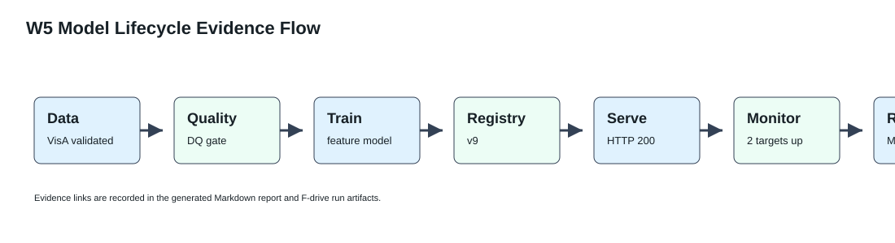
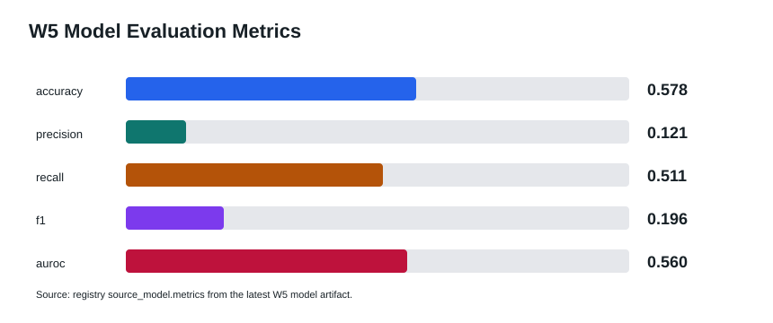
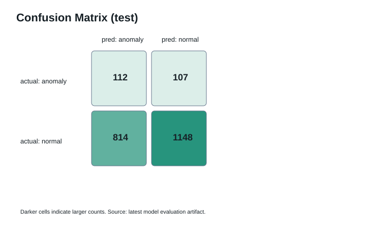
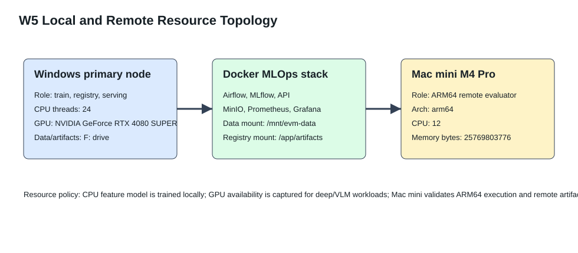

# W5 Real Model Lifecycle Verification

- Generated at: `2026-07-09T07:03:02Z`
- Pipeline run id: `w5-verification-20260709T070302Z`
- Dataset version: `visa-open-data-f1f1c9ee9922`
- Model: `vision-baseline` / `image_feature_centroid`
- Registry version: `10` / stage `Shadow`
- Lifecycle state: `Shadow` / gate `blocked` / decision `shadow_only`

## Visual Evidence

## Verification Summary

- Records used for training: `10821` of `10821`.
- Selected evaluation split: `test`.
- Accuracy: `0.577717`.
- Precision / recall / F1: `0.120950` / `0.511416` / `0.195633`.
- AUROC: `0.559712`.
- Deployment contract: `contract_ok=True`, predict status `200`, feature source `request_features`.
- Monitoring: `2` healthy Prometheus targets of `2` active targets.
- Mac mini remote job: `success`, architecture `arm64`, CPU `12`, memory bytes `25769803776`.
- Promotion blockers: `['accuracy<0.7', 'precision<0.5', 'recall<0.7', 'f1<0.5', 'auroc<0.65']`.

## Resource Use

- Primary data/artifact storage: `F:/EnterpriseMLOps_Data/enterprise-vision-mlops`.
- Local accelerator detected: `True`.
- Local GPU: `NVIDIA GeForce RTX 4080 SUPER`.
- Model training accelerator used: `cpu`.
- Current W5 feature classifier is CPU-bound by design; GPU is reserved and monitored for deep VLM/multimodal training or GPU-backed serving stages.
- Mac mini M4 Pro is connected over Tailscale/SSH as an ARM64 remote evaluator and compatibility runner, not as the primary GPU trainer.

## Evidence Files

- Model artifact: `F:\EnterpriseMLOps_Data\enterprise-vision-mlops\artifacts\models\vision-baseline\model.json`
- Registry latest: `F:\EnterpriseMLOps_Data\enterprise-vision-mlops\artifacts\registry\vision-baseline\latest.json`
- Deployment summary: `F:\EnterpriseMLOps_Data\enterprise-vision-mlops\artifacts\runs\deployment\deployment-20260709T070301Z\summary.json`
- Monitoring summary: `F:\EnterpriseMLOps_Data\enterprise-vision-mlops\artifacts\runs\monitoring\monitoring-20260709T070302Z\summary.json`
- Remote job summary: `F:\EnterpriseMLOps_Data\enterprise-vision-mlops\artifacts\runs\remote_job\remote-job-20260709T064054Z\summary.json`

## Reviewer Notes

- This closes the W4 gap where the registry-serving path could be proven only with a majority-class artifact.
- W5 now has an actual trainable image-feature model, registry versioning, API inference, Prometheus scrape verification, and Mac mini remote execution evidence.
- Model quality is intentionally reported as-is; the current classifier is a lifecycle proof model and remains Shadow-gated when production thresholds are not met.
