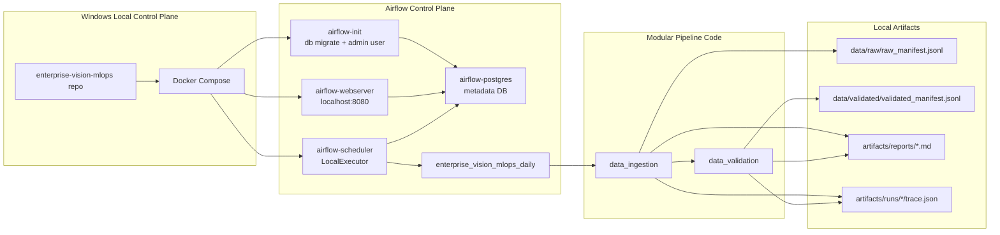
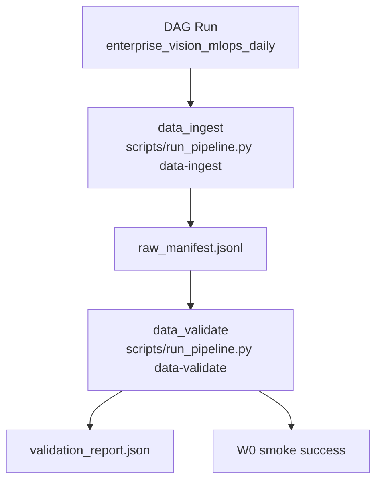
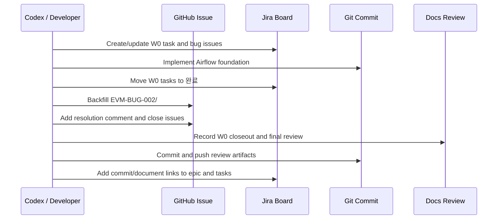
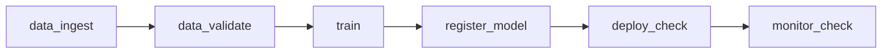
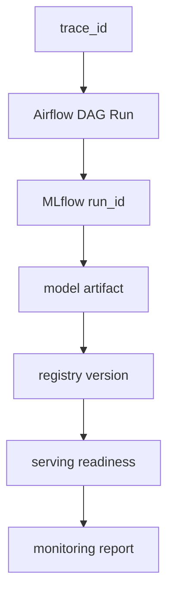

# W0 Airflow Foundation Review

작성일: 2026-06-22
대상 기간: 2026-06-22 ~ 2026-06-28 planned window, implemented early on 2026-06-21~22
대분류: W0 Airflow 기반 orchestration 착수
관련 Epic: `EVM-EPIC-02` / `SCRUM-6` Airflow + MLflow Orchestration
작업 branch: `codex/mac-mini-worker`

## 1. Executive Summary

W0의 목적은 기존 `scripts/run_pipeline.py` 중심의 수동 local MLOps 실행 구조를
Airflow 기반 local control-plane으로 옮기기 시작하는 것이었다. 이번 구간에서는
production-grade 전체 MLOps 플랫폼을 완성하는 것이 아니라, Airflow가 local
orchestrator로 동작하고 `data_ingest -> data_validate`의 첫 DAG 구간을 신뢰 가능하게
실행/검증/추적할 수 있는 기반을 만드는 데 초점을 두었다.

결론적으로 W0는 완료 상태다.

- Airflow webserver, scheduler, init, dedicated metadata DB를 Docker Compose에 추가했다.
- `enterprise_vision_mlops_daily` DAG를 생성하고 Airflow UI/CLI에서 import 가능하게 했다.
- `data_ingest -> data_validate` task chain을 Airflow BashOperator로 연결했다.
- manual DAG run, scheduled DAG run, task instance state, output artifact를 검증했다.
- 구현 중 발생한 Airflow DB migration conflict와 empty DagRun 문제를 Jira/GitHub issue로 기록하고 closed 처리했다.
- W1의 lineage graph 작업을 위해 `TraceContext`와 per-run `trace.json` 기반을 선행 구축했다.

W0 이후 시스템은 아직 full enterprise pipeline은 아니지만, W1에서
`train -> register_model -> deploy_check -> monitor_check`를 붙일 수 있는 orchestrated
foundation이 준비된 상태다.

## 2. Scope And Completion Matrix

| ID | Jira | 목표 | 결과 | 상태 |
|---|---|---|---|---|
| `EVM-021` | `SCRUM-5` | Airflow Docker Compose service 추가 | `airflow-postgres`, `airflow-init`, `airflow-webserver`, `airflow-scheduler` 구성 | Done |
| `EVM-022` | `SCRUM-13` | DAG directory 구성 | `orchestration/airflow/dags` 추가 | Done |
| `EVM-023-A` | `SCRUM-14` | DAG skeleton 생성 | `enterprise_vision_mlops_daily.py` 생성 및 import 검증 | Done |
| `EVM-023-B` | `SCRUM-15` | `data-ingest`, `data-validate` 연결 | Airflow task graph에서 `data_ingest -> data_validate` 구성 | Done |
| `EVM-DOC-021` | `SCRUM-16` | Airflow setup runbook 작성 | `docs/runbooks/airflow-local.md` 작성 | Done |
| `EVM-BUG-002` | `SCRUM-53` | Airflow metadata DB 충돌 해결 | MLflow DB와 Airflow DB 분리 | Closed |
| `EVM-BUG-003` | `SCRUM-54` | empty DagRun 문제 해결 | DAG `start_date` 조정 및 task instance 검증 | Closed |

W0 범위에 포함하지 않은 항목:

- full DAG: `train -> register_model -> deploy_check -> monitor_check`
- MLflow run id와 Airflow DAG run id의 full lineage 연결
- MinIO/Parquet 기반 데이터 플랫폼 전환
- registry-driven serving 완성
- Prometheus/Grafana dashboard 고도화
- CI/CD/CT production hardening

위 항목들은 W1 이후 작업으로 분리되어 있다.

## 3. System Architecture

W0에서 추가한 Airflow control-plane은 기존 local MLOps stack 위에 orchestration layer를
얹는 구조다. 핵심 설계 판단은 Airflow metadata DB와 MLflow backend DB를 분리한 것이다.
두 시스템 모두 Alembic 기반 migration history를 사용하므로 같은 database를 공유하면
revision conflict가 발생한다.



### 3.1 Runtime Services

| Service | Container | Role | Health 기준 |
|---|---|---|---|
| `airflow-postgres` | `evm-airflow-postgres` | Airflow 전용 metadata database | `pg_isready` |
| `airflow-init` | `evm-airflow-init` | DB migration, admin user bootstrap | one-shot success |
| `airflow-webserver` | `evm-airflow-webserver` | Airflow UI/API | `/health` |
| `airflow-scheduler` | `evm-airflow-scheduler` | DAG scheduling, LocalExecutor task execution | `airflow jobs check` |
| `mlflow` | `evm-mlflow` | experiment tracking / future registry linkage | `/health` |
| `api` | `evm-api` | serving API placeholder | `/health` |
| `minio` | `evm-minio` | future object storage layer | port availability |
| `prometheus` | `evm-prometheus` | metric collection | port availability |
| `grafana` | `evm-grafana` | dashboard layer | port availability |

### 3.2 DAG Structure

W0 DAG는 intentionally narrow하다. Full pipeline을 한 번에 Airflow로 옮기기보다,
가장 앞단의 data contract를 먼저 orchestration 대상으로 삼았다.



Task command pattern:

```text
cd /opt/airflow/evm_project
PYTHONPATH=/opt/airflow/evm_project/src
python scripts/run_pipeline.py <pipeline> --config /opt/airflow/evm_project/configs/airflow.toml
```

## 4. Implementation Details

### 4.1 Docker Compose Changes

W0에서 `docker-compose.yml`에 다음 Airflow services가 추가되었다.

- `airflow-postgres`
- `airflow-init`
- `airflow-webserver`
- `airflow-scheduler`

중요한 구현 포인트:

- Airflow는 `apache/airflow:2.10.5-python3.11` 이미지를 사용한다.
- `LocalExecutor`를 사용해 W0 local control-plane에 맞는 단순한 실행 모델을 유지한다.
- Airflow DAG directory는 `./orchestration/airflow/dags:/opt/airflow/dags:ro`로 read-only mount한다.
- repo root는 `/opt/airflow/evm_project`로 mount하여 기존 pipeline code를 재사용한다.
- Airflow logs는 `airflow-logs` named volume으로 분리한다.
- Airflow metadata는 `airflow-postgres-data` named volume으로 분리한다.

### 4.2 Airflow Configuration

Airflow task는 `configs/airflow.toml`을 사용한다. 이 config는 local host URL이 아니라
Docker network 내부 service name을 기준으로 작성되어 있다.

예시:

| Component | Airflow config endpoint |
|---|---|
| MLflow | `http://mlflow:5000` |
| MinIO | `http://minio:9000` |
| API | `http://api:8000` |
| Prometheus | `http://prometheus:9090` |
| Grafana | `http://grafana:3000` |

이 분리는 중요하다. host에서 실행하는 CLI는 `localhost` endpoint를 사용할 수 있지만,
Airflow container 내부 task는 Docker network 기준 endpoint를 사용해야 한다.

### 4.3 Traceability Prework

W0 후반에 W1을 위한 traceability scaffold가 추가되었다. 이것은 W0 목표를 넘는
선행 작업이지만, W1의 Airflow-MLflow lineage 연결을 막힘 없이 진행하기 위한 기반이다.

추가된 구성:

- `src/evm/core/traceability.py`
- `PipelineContext.trace`
- per-run `trace.json`
- markdown report trace field
- Airflow task env propagation
- training pipeline MLflow param prewiring

Trace context는 다음 정보를 포함한다.

| Field | 의미 |
|---|---|
| `trace_id` | DAG run 단위 lineage correlation id |
| `pipeline_run_id` | 개별 pipeline command 실행 id |
| `airflow_dag_id` | Airflow DAG identity |
| `airflow_dag_run_id` | Airflow DAG run identity |
| `airflow_task_id` | Airflow task identity |
| `airflow_try_number` | retry/attempt identity |
| `git_commit` | 실행 code version |
| `git_branch` | 실행 branch |

Trace output path:

```text
artifacts/runs/<pipeline>/<pipeline_run_id>/trace.json
```

이 방식은 enterprise 최종 구조라기보다 local MVP의 lightweight lineage sidecar다.
향후 W1/W2에서 MLflow tag, model registry metadata, object storage metadata,
OpenLineage 또는 metadata catalog 형태로 확장되어야 한다.

## 5. Runtime Verification

### 5.1 Verified Commands

W0에서 다음 검증이 수행되었다.

```powershell
docker compose config --quiet
python -m py_compile orchestration\airflow\dags\enterprise_vision_mlops_daily.py scripts\run_pipeline.py
docker compose up -d airflow-postgres airflow-init airflow-webserver airflow-scheduler
docker compose ps airflow-postgres airflow-webserver airflow-scheduler
docker compose exec airflow-scheduler airflow dags list
docker compose exec airflow-scheduler airflow dags list-import-errors
docker compose exec airflow-scheduler airflow tasks list enterprise_vision_mlops_daily --tree
docker compose exec airflow-scheduler airflow dags trigger -r evm_w0_smoke_20260621T163742 enterprise_vision_mlops_daily
docker compose exec airflow-scheduler airflow tasks states-for-dag-run enterprise_vision_mlops_daily evm_w0_smoke_20260621T163742
```

### 5.2 W0 Smoke Result

Manual smoke run:

```text
evm_w0_smoke_20260621T163742
```

Result:

```text
enterprise_vision_mlops_daily  evm_w0_smoke_20260621T163742  success
data_ingest                    success
data_validate                  success
```

Validation summary:

```json
{
  "input_records": 8,
  "valid_records": 8,
  "invalid_records": 0,
  "failure_reasons": {}
}
```

### 5.3 Scheduled Run Result

After the DAG `start_date` fix, scheduled runs also completed successfully.

```text
scheduled__2026-06-20T00:00:00+00:00  success
scheduled__2026-06-21T00:00:00+00:00  success
```

### 5.4 Final Trace Preflight

W1 preflight trace run:

```text
w1_preflight_trace_final_20260622T094318
```

Trace evidence:

```text
trace_id: enterprise_vision_mlops_daily__w1_preflight_trace_final_20260622T094318
airflow_dag_run_id: w1_preflight_trace_final_20260622T094318
git_commit: b003010e
git_branch: codex/mac-mini-worker
```

The `data_ingestion` and `data_validation` task runs shared the same `trace_id`.
This proves that W1 can propagate one DAG-level correlation id across multiple
pipeline stages.

## 6. Issue Handling And Governance

W0 intentionally used both Jira and GitHub to preserve an engineering audit trail.



### 6.1 Bugs Found During W0

| Bug | Symptom | Root Cause | Fix | Tracking |
|---|---|---|---|---|
| `EVM-BUG-002` | `airflow-init` failed during `airflow db migrate` | Airflow and MLflow shared one Postgres DB, causing Alembic revision conflict | Dedicated `airflow-postgres` DB | Jira `SCRUM-53`, GitHub `#2` |
| `EVM-BUG-003` | DagRun was success but task instances were empty | DAG `start_date` was later than manual smoke logical date | `start_date` moved to `2026-06-01`; task states verified | Jira `SCRUM-54`, GitHub `#3` |

### 6.2 Lessons Learned

1. Airflow and MLflow metadata storage must be isolated unless schemas and migration
   histories are explicitly managed.
2. DagRun state alone is insufficient for smoke validation. Task instance states
   must be checked.
3. Airflow manual run ids should be explicit during verification.
4. Local MVP trace metadata is useful, but it must evolve into a metadata graph
   across MLflow, registry, serving, and monitoring.
5. GitHub Issue and Jira must both be updated when implementation-time bugs occur.

## 7. Commit And Artifact Trace

| Commit | Purpose |
|---|---|
| `07551b7b` | Airflow orchestration foundation |
| `16216a9e` | Jira epic parent cleanup documentation |
| `b003010e` | GitHub bug backfill and W1 traceability prework |

Primary documents:

- `docs/status/2026-06-21-airflow-foundation.md`
- `docs/status/2026-06-22-w0-closeout.md`
- `docs/status/2026-06-22-jira-epic-parent-cleanup.md`
- `docs/architecture-traceability.md`
- `docs/runbooks/airflow-local.md`
- `docs/issues/issue-register.md`

Primary implementation files:

- `docker-compose.yml`
- `.env.example`
- `configs/airflow.toml`
- `orchestration/airflow/dags/enterprise_vision_mlops_daily.py`
- `src/evm/core/pipeline.py`
- `src/evm/core/traceability.py`
- `src/evm/pipelines/training/run.py`

## 8. Engineering Review

### 8.1 What Went Well

- The Airflow integration reused the existing modular pipeline runner instead of
  duplicating logic inside DAG code.
- Airflow service boundaries were separated cleanly from MLflow and serving services.
- The first orchestration target was intentionally small, which made failure
  causes observable and fixable.
- Jira, GitHub, and docs now have consistent links for implementation-time bugs.
- W1 traceability was prepared before full DAG expansion, avoiding a later retrofit.

### 8.2 Technical Debt

| Debt | Impact | Recommended Follow-up |
|---|---|---|
| `trace.json` is local filesystem based | Not enough for multi-node/enterprise lineage | Upload or mirror trace metadata to MLflow/MinIO/catalog |
| Airflow uses LocalExecutor | Good for local MVP, not distributed execution | Consider Celery/Kubernetes executor in later extension |
| Airflow credentials are `admin/admin` | Acceptable only for local lab | Replace before shared/demo environment |
| Git metadata must be injected via env | Manual if not automated | Set in wrapper script or CI/CD runtime |
| DAG currently covers only two tasks | W0 complete but not full MLOps | Extend in W1 |
| Metrics do not yet include pipeline status | Limited operational observability | Add pipeline success/failure metrics in W4 |

### 8.3 W0 Quality Gate Result

| Gate | Result |
|---|---|
| Compose config valid | Pass |
| Airflow services healthy | Pass |
| DAG import errors | Pass, no import errors |
| Manual run creates task instances | Pass |
| `data_ingest` task success | Pass |
| `data_validate` task success | Pass |
| Output artifacts generated | Pass |
| Jira task status updated | Pass |
| GitHub bug issues closed | Pass |
| Final review document created | Pass |

## 9. W1 Handoff

W1 should start from `SCRUM-17` / `EVM-023`.

Target DAG:



W1 must prove that the traceability foundation works beyond data tasks:



Recommended W1 order:

1. Add Airflow tasks for `train`, `register_model`, `deploy_check`, `monitor_check`.
2. Reuse the same trace env propagation for every task.
3. Verify MLflow receives trace params from `training`.
4. Store trace metadata in model registry records.
5. Include trace fields in deployment and monitoring reports.
6. Define retry, timeout, and failure policy under `EVM-024`.
7. Run full DAG smoke and close `EVM-027`.

W1 is complete only when a serving or monitoring artifact can be traced backward to:

```text
serving/monitoring output
 -> registry version
 -> model artifact
 -> MLflow run id
 -> Airflow dag_run_id
 -> data manifest / validation report
 -> git commit
```

## 10. Portfolio Narrative

W0 can be described as follows:

> Built the initial Airflow-based local MLOps control-plane for an enterprise
> vision MLOps project. Separated Airflow and MLflow metadata stores to avoid
> migration conflicts, implemented the first DAG segment for data ingestion and
> validation, validated task-level execution rather than relying only on DagRun
> state, and established Jira/GitHub-backed issue tracking plus early lineage
> scaffolding for Airflow-to-MLflow traceability.

This is stronger than saying "Airflow를 띄웠다" because the review covers service
boundaries, metadata isolation, task-state validation, incident handling, and
future lineage architecture.
