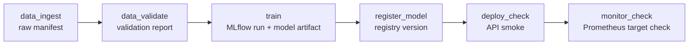
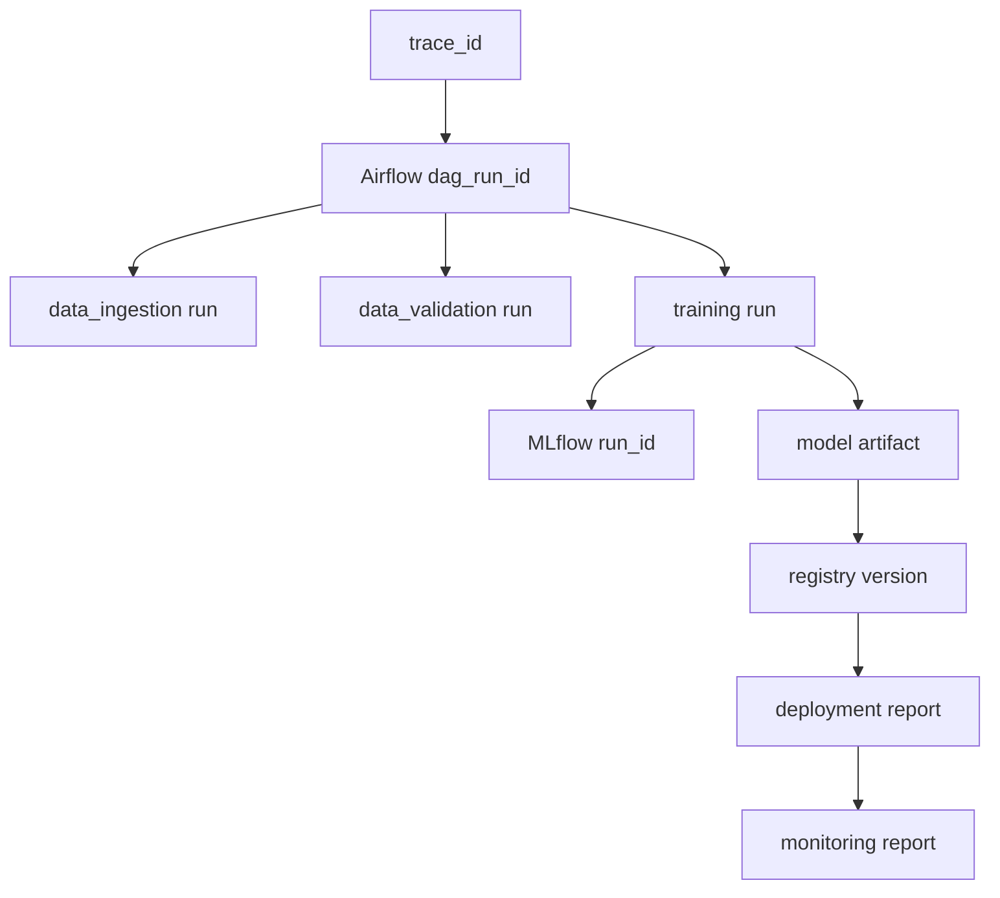

# W1 Full DAG And Traceability Review

작성일: 2026-06-22
대상 기간: 2026-06-29 ~ 2026-07-05 planned window, implemented early on 2026-06-22
대분류: W1 Full DAG + MLflow linkage
관련 Epic: `EVM-EPIC-02` / `SCRUM-6` Airflow + MLflow Orchestration
작업 branch: `codex/mac-mini-worker`

## 1. Executive Summary

W1의 목적은 W0에서 만든 Airflow foundation을 실제 end-to-end MLOps workflow로
확장하는 것이었다. W0에서는 `data_ingest -> data_validate`까지만 orchestration
했지만, W1에서는 기존 modular pipeline command 전체를 Airflow DAG로 연결했다.

최종 DAG는 다음 순서로 실행된다.

```text
data_ingest -> data_validate -> train -> register_model -> deploy_check -> monitor_check
```

W1 결과는 완료 상태다.

- Airflow DAG가 six-stage full pipeline을 실행한다.
- task retry, retry delay, execution timeout, DAG run timeout, `max_active_runs` 정책을 명시했다.
- training task에서 MLflow run을 생성하고 Airflow trace context를 MLflow params에 기록했다.
- model registry, deployment, monitoring reports까지 동일 `trace_id`가 전파됨을 검증했다.
- full DAG smoke run에서 모든 task가 `success`로 완료되었다.
- Jira W1 task는 구현/검증 기준으로 완료 처리 가능한 상태가 되었다.

## 2. Scope And Completion Matrix

| ID | Jira | 목표 | 결과 | 상태 |
|---|---|---|---|---|
| `EVM-023` | `SCRUM-17` | 기존 pipeline command를 Airflow task로 연결 | six-stage full DAG 구성 | Done |
| `EVM-023-C` | `SCRUM-20` | `train` task 연결 | training task success, MLflow run 생성 | Done |
| `EVM-023-D` | `SCRUM-21` | `register-model` task 연결 | registry version 생성 | Done |
| `EVM-023-E` | `SCRUM-22` | `deploy-check`, `monitor-check` 연결 | deployment/monitoring report 생성 | Done |
| `EVM-024` | `SCRUM-18` | retry/timeout/log policy 설정 | task/DAG policy 명시 | Done |
| `EVM-025` | `SCRUM-19` | MLflow run id와 Airflow run context 연결 | MLflow params에 trace fields 기록 | Done |
| `EVM-026` | `SCRUM-23` | Airflow runbook/status 문서 작성 | runbook/status/review 문서 갱신 | Done |
| `EVM-027` | `SCRUM-24` | Phase 2 smoke 검증 | full DAG smoke success | Done |

## 3. Full DAG Architecture



Airflow still calls the same modular CLI entrypoint:

```text
python scripts/run_pipeline.py <pipeline> --config configs/airflow.toml
```

This is intentionally conservative. Instead of embedding business logic inside
the DAG file, Airflow remains the orchestration layer and the pipeline modules
remain the execution units.

## 4. Traceability Architecture

W1 moved traceability from W0 prework into the full pipeline. The key design is
not a simple 1:1 ID mapping. It is a lineage graph rooted in one `trace_id`.



Each pipeline run writes:

```text
artifacts/runs/<pipeline>/<run_id>/trace.json
```

The same trace fields are also rendered in markdown reports and, for training,
logged into MLflow params.

## 5. Final Smoke Validation

Final run id:

```text
w1_full_dag_final_20260622T131505
```

Final trace id:

```text
enterprise_vision_mlops_daily__w1_full_dag_final_20260622T131505
```

Task state result:

```text
data_ingest     success
data_validate   success
train           success
register_model  success
deploy_check    success
monitor_check   success
```

Trace fields observed across all six stages:

```text
airflow_dag_run_id: w1_full_dag_final_20260622T131505
git_commit: 39a4c937
git_branch: codex/mac-mini-worker
```

## 6. MLflow Linkage

Training created MLflow run:

```text
09e571333c244cc39d0cdd72ce25a3f1
```

The following params were verified through MLflow REST API:

```text
trace_id
pipeline_name
pipeline_run_id
airflow_dag_id
airflow_dag_run_id
airflow_task_id
airflow_try_number
git_commit
git_branch
```

This means a model training record can be traced back to:

```text
MLflow run_id
 -> Airflow dag_run_id
 -> Airflow task_id / try_number
 -> pipeline_run_id
 -> git commit
```

## 7. Registry, Deployment, And Monitoring Evidence

| Stage | Evidence |
|---|---|
| training | MLflow run `09e571333c244cc39d0cdd72ce25a3f1`, model artifact under `artifacts/models/vision-baseline/model.json` |
| model registry | registry version `5`, `artifacts/registry/vision-baseline/latest.json` |
| deployment | `/health`, `/ready`, `/predict` returned HTTP `200` |
| monitoring | Prometheus target status HTTP `200`, healthy targets `2` |

Known limitation:

- `/predict` still returns `placeholder: true`. Replacing placeholder serving
  with registry-loaded model inference remains a W3 serving task.

## 8. Retry, Timeout, And Logging Policy

W1 formalized Airflow execution policy in the DAG file.

| Policy | Value | Override |
|---|---:|---|
| task retries | `1` | `EVM_AIRFLOW_TASK_RETRIES` |
| retry delay | `2` minutes | `EVM_AIRFLOW_RETRY_DELAY_MINUTES` |
| task execution timeout | `10` minutes | `EVM_AIRFLOW_TASK_TIMEOUT_MINUTES` |
| DAG run timeout | `45` minutes | `EVM_AIRFLOW_DAG_TIMEOUT_MINUTES` |
| max active DAG runs | `1` | code-level setting |

Task shell command starts with:

```bash
set -euo pipefail
```

This makes shell-level failures visible to Airflow task state instead of being
silently swallowed.

## 9. Engineering Review

### 9.1 What Improved From W0

- DAG moved from two data tasks to full local MLOps sequence.
- Airflow task state now covers data, training, registry, deployment, and monitoring.
- MLflow now records Airflow lineage params.
- Registry/deployment/monitoring reports include trace id and pipeline run id.
- Retry/timeout/log behavior is configurable and documented.

### 9.2 Remaining Technical Debt

| Debt | Impact | Target |
|---|---|---|
| Serving still uses placeholder prediction | Model registry is not yet driving API inference | W3 |
| Trace metadata remains local + MLflow params | No object-store/catalog-backed lineage yet | W2/W4 |
| LocalExecutor only | Not distributed or GPU-aware | later enterprise extension |
| Registry is local JSON files | Sufficient for MVP, not production-grade | W3+ |
| No alerting on DAG failure | Operational notification incomplete | W4 |

## 10. W2 Handoff

W2 should start from object storage and dataset platform work:

- `EVM-031`: MinIO bucket bootstrap hardening.
- `EVM-032`: object storage client module.
- `EVM-033`: public vision dataset ingest.
- `EVM-034`: validation report hardening.
- `EVM-035`: Parquet dataset generation.
- `EVM-036`: dataset version metadata.

W2 should preserve the W1 trace model. Dataset metadata should include:

```text
trace_id
airflow_dag_run_id
data_ingestion_run_id
data_validation_run_id
raw_manifest_uri
validated_manifest_uri
parquet_dataset_uri
dataset_version
git_commit
```

## 11. Portfolio Narrative

W1 can be summarized as:

> Extended the Airflow local control-plane from a two-step data DAG into a full
> six-stage MLOps workflow covering ingestion, validation, training, model
> registry, deployment smoke, and monitoring checks. Added task-level retry and
> timeout policy, propagated a single trace id across all pipeline stages, and
> verified Airflow-to-MLflow linkage by recording DAG/task/git metadata as
> MLflow params.

This is the first point where the project can be described as an end-to-end
orchestrated MLOps pipeline rather than only a local MVP collection of scripts.
