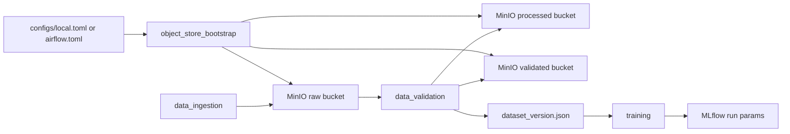

# W2 Object Storage Data Platform Review

Created: 2026-07-01
Planned window: 2026-07-06 to 2026-07-12, implemented early on 2026-07-01
Category: W2 Object Storage Data Platform
Related Epic: `EVM-EPIC-03` / `SCRUM-7` Object Storage Data Platform
Branch: `codex/mac-mini-worker`

## 1. Executive Summary

W2 converted the project from a local-file-only MLOps demo into a dataset
platform shape that better resembles enterprise practice. The pipeline now has
explicit object storage zones, object-level validation, Parquet dataset outputs,
and dataset version metadata that is propagated into training and MLflow.

The final DAG path is:

```text
object_store_bootstrap -> data_ingest -> data_validate -> train -> register_model -> deploy_check -> monitor_check
```

W2 is complete by implementation, validation, and documentation criteria.

## 2. Completion Matrix

| ID | Jira | Objective | Result | Status |
|---|---|---|---|---|
| `EVM-031` | `SCRUM-25` | MinIO bucket bootstrap hardening | `raw`, `processed`, `validated`, `mlflow-artifacts` ensured | Done |
| `EVM-032` | `SCRUM-26` | object storage client module | `ObjectStoreClient` added for bucket, upload, list, exists | Done |
| `EVM-033` | `SCRUM-27` | public vision dataset ingest | raw image objects and raw manifest uploaded | Done |
| `EVM-034` | `SCRUM-28` | validation report hardening | schema, object existence, label, dimension report | Done |
| `EVM-035` | `SCRUM-29` | Parquet dataset generation | processed and validated Parquet files generated | Done |
| `EVM-036` | `SCRUM-30` | dataset version metadata | `dataset_version.json` created and consumed by training | Done |

## 3. Architecture



The design keeps Airflow as orchestration, pipeline modules as execution units,
and MinIO as the object data plane. This is intentionally close to enterprise
MLOps patterns where compute, orchestration, artifact storage, and lineage are
separate responsibilities.

## 4. Data Contract

Raw zone:

```text
s3://raw/public-vision-local/v1/images/*.jpg
s3://raw/public-vision-local/v1/manifests/raw_manifest.jsonl
```

Processed zone:

```text
s3://processed/public-vision-local/<dataset_version>/processed/processed_dataset.parquet
```

Validated zone:

```text
s3://validated/public-vision-local/<dataset_version>/manifests/validated_manifest.jsonl
s3://validated/public-vision-local/<dataset_version>/validated/validated_dataset.parquet
s3://validated/public-vision-local/<dataset_version>/metadata/dataset_version.json
s3://validated/public-vision-local/<dataset_version>/reports/validation_report.json
```

The dataset version is content-derived from stable record fields:

```text
public-vision-local-3cafd20ac032
```

## 5. Validation Evidence

Final Airflow run:

```text
w2_data_platform_final_20260701T141903
```

Task states:

```text
object_store_bootstrap  success
data_ingest             success
data_validate           success
train                   success
register_model          success
deploy_check            success
monitor_check           success
```

Object counts:

| Bucket | Count |
|---|---:|
| raw | 9 |
| processed | 1 |
| validated | 4 |

Parquet checks:

| Path | Rows |
|---|---:|
| `data/processed/processed_dataset.parquet` | 8 |
| `data/validated/validated_dataset.parquet` | 8 |

Training MLflow run:

```text
4b17f766aa8d45bc92688512dff7c776
```

Verified MLflow params:

```text
trace_id
airflow_dag_run_id
git_commit
dataset_version
validated_parquet_uri
```

## 6. Engineering Review

### Improvements From W1

- Airflow now starts from object storage bootstrap rather than data ingestion.
- Data ingestion creates actual MinIO raw objects instead of only local JSONL.
- Data validation checks object existence and emits schema, label, dimension,
  and failure-reason evidence.
- Parquet datasets are generated and uploaded to MinIO.
- Training now records dataset version lineage in the model payload and MLflow.

### Remaining Technical Debt

| Debt | Impact | Target |
|---|---|---|
| Synthetic dataset seed | Platform is proven, but not large real ingestion | W3/W4 extension |
| Single-file Parquet | No partitioning/compaction story yet | later data platform hardening |
| Local JSON catalog | No Iceberg/Delta/SQL catalog yet | later enterprise extension |
| `uv.lock` not regenerated | Dependency lock is stale because `uv` is unavailable locally | next dependency tooling pass |

## 7. Portfolio Narrative

W2 can be summarized as:

> Built a MinIO-backed dataset platform layer for a modular vision MLOps
> pipeline. Added bucket bootstrap, S3-compatible object upload/list/existence
> checks, Parquet dataset materialization, content-derived dataset version
> metadata, and MLflow training lineage that links a model run back to the
> validated dataset version and object URI.

This gives the portfolio a concrete story around large-data platform mechanics,
not just model training or serving.

## 8. W3 Handoff

W3 should preserve `dataset_version` and `validated_parquet_uri` as immutable
inputs to downstream remote training and serving work. The next architecture
step is to make model serving registry-driven while exposing both model version
and dataset version through readiness and monitoring surfaces.
