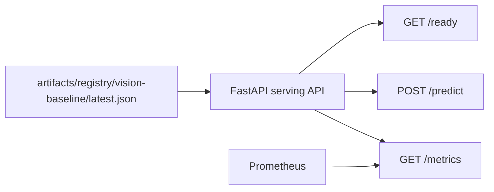

# W3 Registry-Driven Serving Review

Created: 2026-07-05
Category: W3 Registry-driven Serving
Related Epic: `EVM-EPIC-05` / `SCRUM-9`
Branch: `codex/mac-mini-worker`

## 1. Executive Summary

W3 serving moved the API from placeholder inference to registry-driven local
serving. The API now reads the promoted local registry artifact, exposes model
and dataset metadata through `/ready` and `/predict`, and publishes model-load
metrics for Prometheus.

This closes the most visible gap left after W1/W2: the pipeline could train and
register a model, but the API did not previously consume the registry output.

## 2. Completion Matrix

| ID | Objective | Result | Status |
|---|---|---|---|
| `EVM-051` | Load promoted model artifact in API | API loads `latest.json` from mounted registry path | Done |
| `EVM-052` | Extend `/ready` model readiness | `/ready` reports model, version, stage, dataset, registry path | Done |
| `EVM-053` | Remove placeholder prediction | `/predict` returns artifact-derived `prediction` and `placeholder=false` | Done |
| `EVM-054` | Expose model version metrics | `/metrics` exposes model loaded/version/info gauges | Done |
| `EVM-055` | Rollback-ready registry contract | Runbook documents `latest.json` rollback path | Done |

## 3. Architecture



The API reads the same registry artifact produced by the existing
`register_model` pipeline. Docker Compose mounts `./artifacts` into the API
container as read-only data, so the API can consume the current promoted model
without baking registry state into the image.

## 4. Verification Evidence

`/ready`:

```text
status=ok
mlflow_ready=true
model_loaded=true
model_name=vision-baseline
model_stage=Production
model_version=17
dataset_version=public-vision-local-3cafd20ac032
```

`/predict`:

```text
prediction=normal
confidence=0.5
placeholder=false
validated_parquet_uri=s3://validated/public-vision-local/public-vision-local-3cafd20ac032/validated/validated_dataset.parquet
```

Deployment and monitoring checks:

```text
deploy-check contract_ok=True
monitor-check healthy_targets=2
w3_preflight pass=7 warn=0 fail=0
```

## 5. Engineering Review

What improved:

- Serving now consumes registry output instead of duplicating placeholder logic.
- Readiness is no longer only an MLflow health probe; it also reports model load
  state.
- Prediction responses carry model and dataset lineage.
- Prometheus can observe the loaded model version.
- Deployment smoke now fails if placeholder serving comes back.

Remaining technical debt:

| Debt | Impact | Target |
|---|---|---|
| Local file registry remains source of truth | No MLflow Registry stage promotion yet | W4+ / enterprise extension |
| Baseline model is majority-class metadata | Not a real vision model or VLM | later model milestone |
| API reload path is simple file reload | No canary or watched registry events | later serving hardening |
| Remote execution track was completed later on 2026-07-05 | W3 is now complete overall | `remote-job-20260705T100117Z` |

## 6. Handoff

The remote execution handoff was completed later on 2026-07-05:

1. `EVM-041`: structured remote job spec.
2. `EVM-042`: mac-mini ARM64 evaluation job.
3. `EVM-044`: worker resource report.
4. `EVM-045`: remote artifact collection.

Evidence: `remote-job-20260705T100117Z` completed with `status=success` and
`artifacts_collected=true`.
