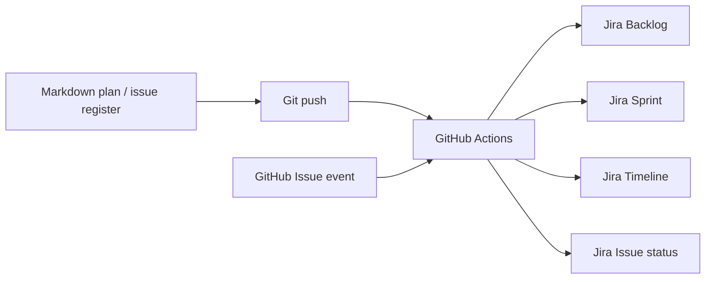

# Jira Schedule Sync Runbook

작성일: 2026-06-21

## 목적

이 문서는 `docs/issues/issue-register.md`와
`docs/agenda/enterprise-mlops-accelerated-weekly-schedule.md`에 정리한 2026년 7월
enterprise MLOps 구현 일정을 Jira board에 동기화하기 위한 절차다.

현재 Codex 세션에는 Jira 전용 connector가 없으므로 Jira Cloud REST API 기반
script를 사용한다.

## 동기화 기준

Source of truth:

1. `docs/issues/issue-register.md`
2. `docs/agenda/enterprise-mlops-accelerated-weekly-schedule.md`
3. Jira board

실시간 반영 경로:



여기서 "실시간"은 다음 trigger 기준으로 정의한다.

- 계획 문서 변경 후 push: Jira backlog, sprint, due date, timeline field 갱신
- GitHub Issue open/edit/close/reopen/label 변경: Jira issue 생성/갱신/상태 전이
- 수동 `workflow_dispatch`: 전체 계획과 sprint를 즉시 재동기화

Jira에는 다음 형태로 생성한다.

| Markdown | Jira |
|---|---|
| `EVM-EPIC-*` | Epic |
| `EVM-*`, `EVM-DOC-*`, `EVM-QA-*` | Task |
| `Due` 또는 `Target` | Due date |
| `Acceptance Criteria` 또는 `Output` | Description |
| source id | Jira label |

기본 label:

- `evm`
- `enterprise-mlops`
- source id label, for example `evm-021`
- `july-cut` 또는 `planning`

`codex-managed` label은 사용하지 않는다.

## 사전 준비

Jira Cloud project를 먼저 생성한다.

필요한 값:

- Jira site URL: `https://<site>.atlassian.net`
- Jira login email
- Jira API token
- Jira project key, for example `EVM`

`JIRA_BASE_URL`에는 원칙적으로 site root만 넣는다. 예를 들어 현재 확인된 site root는
다음과 같다.

```text
https://opop0236.atlassian.net
```

전체 Jira 화면 URL을 넣더라도 `scripts/dev/jira_sync.py`는 `.atlassian.net` host까지만
자동 정규화한다. 단, 운영 변수에는 site root만 저장하는 것을 권장한다.

현재 계획값:

| Item | Value | Note |
|---|---|---|
| API token name | `mlops_key` | 실제 token value는 Git에 저장하지 않는다. |
| Workspace / project name | `MLOps` | Jira 화면에 표시되는 이름 |
| Confirmed Jira Software project key | `SCRUM` | REST API `/rest/api/3/project/SCRUM` 확인 완료 |
| Confirmed Jira Software project id | `10000` | REST API 확인 완료 |
| Confirmed board id | `1` | Board URL과 REST API 확인 완료 |
| Confirmed board name | `SCRUM board` | REST API 확인 완료 |
| Board project location | `MLOps (SCRUM)` | project name은 `MLOps`, key는 `SCRUM` |
| Observed Product Discovery key candidate | `ZWIW` | Jira Product Discovery URL path에서 관측됨. Software board key는 아님 |

PowerShell 환경 변수:

```powershell
$env:JIRA_BASE_URL="https://<site>.atlassian.net"
$env:JIRA_EMAIL="<email>"
$env:JIRA_API_TOKEN="<api-token>"
$env:JIRA_PROJECT_KEY="SCRUM"
$env:JIRA_BOARD_ID="1"
```

Project issue type 이름이 다르면 다음도 설정한다.

```powershell
$env:JIRA_EPIC_ISSUE_TYPE="Epic"
$env:JIRA_TASK_ISSUE_TYPE="Task"
$env:JIRA_SPRINT_PREFIX="EVM"
$env:JIRA_STATUS_TRANSITION_MAP='{"Next":["Selected for Development","To Do"],"In Progress":["In Progress"],"Blocked":["Blocked"],"Done":["Done"]}'
```

GitHub Actions secret / variable:

| Name | Type | Required | Purpose |
|---|---|---:|---|
| `JIRA_BASE_URL` | Secret | Yes | Jira site URL |
| `JIRA_EMAIL` | Secret | Yes | Jira API user email |
| `JIRA_API_TOKEN` | Secret | Yes | `mlops_key` token value |
| `JIRA_PROJECT_KEY` | Secret | Yes | `MLOPS` or verified project key |
| `JIRA_BOARD_ID` | Secret | Yes for sprint sync | Scrum board id |
| `JIRA_EPIC_ISSUE_TYPE` | Variable | No | Default `Epic` |
| `JIRA_TASK_ISSUE_TYPE` | Variable | No | Default `Task` |
| `JIRA_SPRINT_PREFIX` | Variable | No | Default `EVM` |
| `JIRA_STATUS_TRANSITION_MAP` | Variable | No | Workflow-specific status mapping |

## Dry-run

Jira 인증 없이도 생성 예정 항목을 확인할 수 있다.

```powershell
python .\scripts\dev\jira_sync.py `
  --project-root . `
  --project-key SCRUM `
  --dry-run
```

Task만 확인:

```powershell
python .\scripts\dev\jira_sync.py `
  --project-root . `
  --project-key SCRUM `
  --mode tasks `
  --dry-run
```

## 실제 동기화

```powershell
python .\scripts\dev\jira_sync.py `
  --project-root . `
  --mode all
```

Sprint와 Timeline까지 같이 반영:

```powershell
python .\scripts\dev\jira_sync.py `
  --project-root . `
  --mode all `
  --sync-sprints `
  --assign-sprints `
  --transition-statuses
```

현재 확인된 project/board 기준으로는 위 명령 실행 전에 다음 값이 필요하다.

```powershell
$env:JIRA_PROJECT_KEY="SCRUM"
$env:JIRA_BOARD_ID="1"
```

기본 동작:

- 동일 source id label이 있는 Jira issue를 찾는다.
- 있으면 summary, description, due date, label을 업데이트한다.
- 없으면 새 issue를 생성한다.
- `Done`과 `Deferred` 항목은 기본적으로 제외한다.

완료된 baseline이나 2027 확장 항목까지 함께 만들고 싶다면 다음 옵션을 추가한다.

```powershell
python .\scripts\dev\jira_sync.py `
  --project-root . `
  --mode all `
  --include-done `
  --include-deferred
```

Epic parent field를 지원하는 Jira project라면 다음 옵션을 사용한다.

```powershell
python .\scripts\dev\jira_sync.py `
  --project-root . `
  --mode all `
  --parent-mode parent-field
```

단, Jira project type에 따라 Epic parent field 정책이 다를 수 있으므로 최초에는
`--parent-mode none`으로 생성한 뒤 board에서 hierarchy를 확인한다.

## GitHub Actions 자동 동기화

Workflow:

```text
.github/workflows/jira-realtime-sync.yml
```

Trigger:

- `push` to `main` or `codex/mac-mini-worker`
- `workflow_dispatch`
- GitHub Issue event:
  - opened
  - edited
  - reopened
  - closed
  - labeled
  - unlabeled

Plan sync job:

```text
Markdown agenda/register
-> Jira Epic/Task upsert
-> W0~W5 sprint create/reuse
-> weekly task sprint assignment
-> optional status transition
```

GitHub Issue sync job:

```text
GitHub Issue event
-> source id extraction
-> Jira issue upsert
-> optional status transition
```

GitHub Issue source id 규칙:

- 제목 또는 본문에 `[EVM-021]`, `EVM-BUG-001` 같은 id가 있으면 그 값을 사용한다.
- 없으면 `GH-ISSUE-<number>`를 Jira source id로 사용한다.

GitHub Issue 상태 매핑:

| GitHub State / Label | Jira Status Intent |
|---|---|
| open | `Next` |
| `in-progress` label | `In Progress` |
| `blocked` label | `Blocked` |
| closed | `Done` |

Jira workflow마다 transition 이름이 다르므로, 필요하면
`JIRA_STATUS_TRANSITION_MAP` variable로 실제 Jira column 이름에 맞춘다.

## 권장 Board 구성

| Jira Column | Markdown Status |
|---|---|
| Backlog | `Planned` |
| Selected for Development | `Next` |
| In Progress | `In Progress` |
| Blocked | `Blocked` |
| Done | `Done` |

Due date 기준:

- W0: 2026-06-28
- W1: 2026-07-05
- W2: 2026-07-12
- W3: 2026-07-19
- W4: 2026-07-26
- W5: 2026-07-31

## 운영 규칙

- Markdown 일정이 바뀌면 script를 다시 실행해 Jira를 업데이트한다.
- Jira에서 일정만 바꾼 경우 `issue-register.md`에도 반드시 반영한다.
- 완료한 작업은 Jira issue, Git commit, `docs/status` 문서가 서로 연결되어야 한다.
- API token은 repository에 commit하지 않는다.
- Sprint 자동 배치는 `JIRA_BOARD_ID`가 설정되어 있을 때만 수행한다.
- Timeline은 Epic/Task, due date, parent 관계를 기반으로 구성한다.
- parent field가 Jira project에서 거부되면 `--parent-mode none`으로 sync하고 Jira UI에서 hierarchy를 수동 조정한다.
- Jira Product Discovery의 `ideas` project는 Jira Software Scrum backlog/sprint와 다를 수 있다.
  Sprint 자동화를 원하면 Jira Software Scrum board의 `JIRA_BOARD_ID`가 필요하다.
- 현재 `MLOps`는 project name이고, REST API에서 사용하는 project key는 `SCRUM`이다.

## 참고 API

- Jira Cloud REST API v3: https://developer.atlassian.com/cloud/jira/platform/rest/v3/intro/
- Issue create/update API: https://developer.atlassian.com/cloud/jira/platform/rest/v3/api-group-issues/
- JQL search API: https://developer.atlassian.com/cloud/jira/platform/rest/v3/api-group-issue-search/
- Jira Software Cloud Sprint API: https://developer.atlassian.com/cloud/jira/software/rest/api-group-sprint/
- Jira Software Cloud Board/Backlog API: https://developer.atlassian.com/cloud/jira/software/rest/api-group-board/
