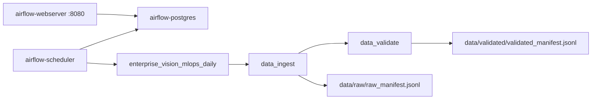

# 2026-06-21 Airflow Foundation Status

## Scope

Completed the W0 Airflow local orchestration foundation for:

- `EVM-021` / `SCRUM-5`: Airflow Docker Compose services.
- `EVM-022` / `SCRUM-13`: DAG directory and DAG file.
- `EVM-023-A` / `SCRUM-14`: DAG skeleton import.
- `EVM-023-B` / `SCRUM-15`: `data_ingest -> data_validate` task chain.
- `EVM-DOC-021` / `SCRUM-16`: Airflow local runbook.

## Implemented Files

- `docker-compose.yml`
- `.env.example`
- `configs/airflow.toml`
- `orchestration/airflow/dags/enterprise_vision_mlops_daily.py`
- `orchestration/airflow/dags/__init__.py`
- `docs/runbooks/airflow-local.md`
- `docs/pipelines/00_pipeline_overview.md`
- `docs/pipelines/01_data_ingestion.md`
- `docs/pipelines/02_data_validation.md`
- `docs/issues/issue-register.md`

## Runtime Topology



Airflow uses a dedicated `airflow-postgres` metadata database. MLflow keeps its own
Postgres backend database, so Alembic migration histories do not collide.

## Smoke Run

Manual run id:

```text
evm_w0_smoke_20260621T163742
```

Verified commands:

```powershell
docker compose config --quiet
python -m py_compile orchestration\airflow\dags\enterprise_vision_mlops_daily.py scripts\run_pipeline.py
docker compose up -d airflow-postgres airflow-init airflow-webserver airflow-scheduler
docker compose exec airflow-scheduler airflow dags list
docker compose exec airflow-scheduler airflow tasks list enterprise_vision_mlops_daily --tree
docker compose exec airflow-scheduler airflow dags trigger -r evm_w0_smoke_20260621T163742 enterprise_vision_mlops_daily
docker compose exec airflow-scheduler airflow tasks states-for-dag-run enterprise_vision_mlops_daily evm_w0_smoke_20260621T163742
```

Result:

```text
enterprise_vision_mlops_daily  evm_w0_smoke_20260621T163742  success
data_ingest                    success
data_validate                  success
```

Generated outputs:

```text
data/raw/raw_manifest.jsonl
data/validated/validated_manifest.jsonl
data/validated/validation_report.json
artifacts/reports/data_ingestion.md
artifacts/reports/data_validation.md
```

Validation summary:

```json
{
  "input_records": 8,
  "valid_records": 8,
  "invalid_records": 0,
  "failure_reasons": {}
}
```

## Issues Found And Resolved

`EVM-BUG-002` / `SCRUM-53`:

- Symptom: `airflow-init` failed with an Alembic revision error.
- Root cause: Airflow metadata tables were pointed at the same Postgres database
  used by MLflow.
- Fix: add dedicated `airflow-postgres` service and point Airflow SQLAlchemy
  connection to the `airflow` database.

`EVM-BUG-003` / `SCRUM-54`:

- Symptom: manual DagRun was `success`, but task instances were empty.
- Root cause: DAG `start_date` was `2026-06-22`, later than the manual smoke
  logical date on `2026-06-21`.
- Fix: set DAG `start_date` to `2026-06-01`, reparse scheduler, and rerun manual
  smoke validation.

## Next Work

- `EVM-023`: extend the same DAG to `train -> register_model -> deploy_check -> monitor_check`.
- `EVM-024`: formalize retry, timeout, logging, and failure notification policy.
- `EVM-025`: attach Airflow context to MLflow runs through tags or params.
