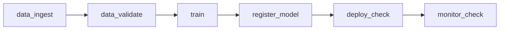

# 2026-06-22 W1 Full DAG Status

## Scope

Implemented and validated the W1 Airflow full DAG and first complete
Airflow-to-MLflow traceability path.

Completed tasks:

- `EVM-023` / `SCRUM-17`: connect existing pipeline commands to Airflow full DAG.
- `EVM-023-C` / `SCRUM-20`: add `train` task.
- `EVM-023-D` / `SCRUM-21`: add `register_model` task.
- `EVM-023-E` / `SCRUM-22`: add `deploy_check` and `monitor_check` tasks.
- `EVM-024` / `SCRUM-18`: add retry, timeout, and logging policy.
- `EVM-025` / `SCRUM-19`: connect Airflow run context to MLflow params and downstream reports.
- `EVM-026` / `SCRUM-23`: update Airflow runbook/status documentation.
- `EVM-027` / `SCRUM-24`: run full DAG smoke validation.

## DAG



## Full DAG Smoke

Run id:

```text
w1_full_dag_precommit_20260622T131155
```

Task states:

```text
data_ingest     success
data_validate   success
train           success
register_model  success
deploy_check    success
monitor_check   success
```

## Traceability Result

Shared trace id:

```text
enterprise_vision_mlops_daily__w1_full_dag_precommit_20260622T131155
```

All six pipeline stages wrote `trace.json` with the same `trace_id` and
`airflow_dag_run_id`.

Verified downstream artifacts:

| Stage | Evidence |
|---|---|
| training | `artifacts/reports/training.md`, MLflow run id `02c219acf5214198b112d4286bbe5608` |
| model registry | `artifacts/reports/model_registry.md`, registry version `4` |
| deployment | `artifacts/reports/deployment.md`, health/ready/predict HTTP `200` |
| monitoring | `artifacts/reports/monitoring.md`, healthy Prometheus targets `2` |

MLflow params verified on run `02c219acf5214198b112d4286bbe5608`:

```text
trace_id
pipeline_name
pipeline_run_id
airflow_dag_id
airflow_dag_run_id
airflow_task_id
airflow_try_number
git_commit
git_branch
```

## Retry And Timeout Policy

| Policy | Value |
|---|---:|
| task retries | `1` |
| retry delay | `2` minutes |
| task execution timeout | `10` minutes |
| DAG run timeout | `45` minutes |
| max active DAG runs | `1` |

Task shell execution uses `set -euo pipefail`.

## Known Limitations

- Serving still returns `placeholder: true`; registry-driven model loading is a W3 task.
- Trace metadata is local filesystem plus MLflow params; MinIO/catalog lineage is W2+ work.
- The current executor is Airflow `LocalExecutor`; distributed worker execution is a later extension.
