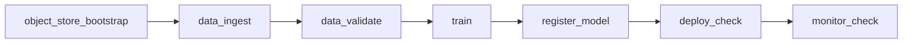

# 2026-07-01 W2 Object Storage Data Platform Status

## Scope

W2 moved the data path from local JSONL-only execution to a MinIO-backed data
platform with raw, processed, and validated zones. It also added Parquet dataset
outputs and dataset version metadata that is consumed by training and logged to
MLflow.

Completed tasks:

- `EVM-031` / `SCRUM-25`: MinIO bucket bootstrap hardening.
- `EVM-032` / `SCRUM-26`: object storage client module.
- `EVM-033` / `SCRUM-27`: public vision dataset ingest.
- `EVM-034` / `SCRUM-28`: validation report hardening.
- `EVM-035` / `SCRUM-29`: Parquet dataset generation.
- `EVM-036` / `SCRUM-30`: dataset version metadata.

## DAG



## Final Airflow Smoke

Run id:

```text
w2_data_platform_final_20260701T141903
```

Task states:

```text
object_store_bootstrap  success
data_ingest             success
data_validate           success
train                   success
register_model          success
deploy_check            success
monitor_check           success
```

Trace id:

```text
enterprise_vision_mlops_daily__w2_data_platform_final_20260701T141903
```

Git metadata:

```text
git_commit: 59188219
git_branch: codex/mac-mini-worker
```

## Object Store Evidence

MinIO object counts under `public-vision-local`:

| Bucket | Object Count | Contents |
|---|---:|---|
| `raw` | 9 | 8 sample image objects + raw manifest |
| `processed` | 1 | processed Parquet dataset |
| `validated` | 4 | validated manifest, validation report, dataset metadata, validated Parquet |

Buckets ensured by `object_store_bootstrap`:

```text
raw
processed
validated
mlflow-artifacts
```

## Dataset Evidence

Dataset version:

```text
public-vision-local-3cafd20ac032
```

Dataset metadata:

```text
data/validated/dataset_version.json
```

Parquet outputs:

| Dataset | Rows | URI |
|---|---:|---|
| processed | 8 | `s3://processed/public-vision-local/public-vision-local-3cafd20ac032/processed/processed_dataset.parquet` |
| validated | 8 | `s3://validated/public-vision-local/public-vision-local-3cafd20ac032/validated/validated_dataset.parquet` |

Validation summary:

```text
input_records: 8
valid_records: 8
invalid_records: 0
label_counts: normal=4, scratch=2, stain=2
dimensions: width 640-672, height 480-496
```

## MLflow Linkage

Training MLflow run:

```text
4b17f766aa8d45bc92688512dff7c776
```

Verified params:

```text
trace_id
airflow_dag_run_id
git_commit
dataset_version
validated_parquet_uri
```

The model training record now points back to the immutable dataset version and
validated Parquet URI, not only the local validated manifest.

## Remaining Technical Debt

- Dataset seed is deterministic and synthetic; W2 proves platform mechanics, not
  large real dataset ingestion yet.
- Dataset catalog is local JSON metadata plus MinIO objects; no SQL/Iceberg/Delta
  catalog exists yet.
- Parquet is generated as single files; partitioning and compaction are future
  work.
- `uv.lock` was not regenerated because the current local shell does not have
  `uv` installed. Runtime validation was performed inside the Airflow container,
  where `boto3` and `pyarrow` are available.

## W3 Handoff

W3 should build on the dataset version contract:

- remote job spec should accept `dataset_version` and `validated_parquet_uri`
  as immutable inputs,
- registry-driven serving should preserve model-to-dataset lineage,
- model readiness should expose model version and dataset version together.
